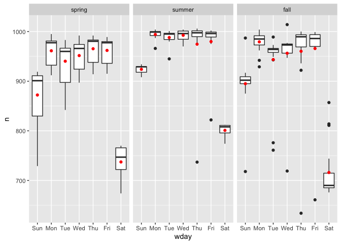
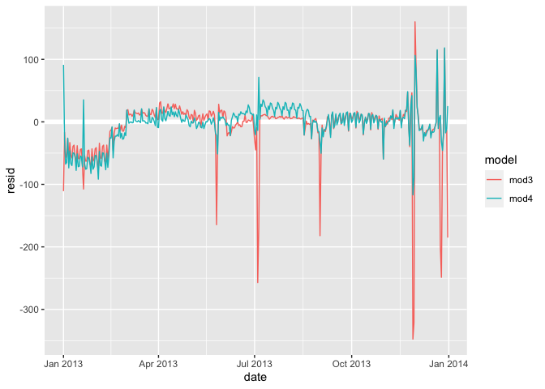

R4DS Model Section: Model Building Chapter
================
H. David Shea
29 January 2021

We’ll find patterns with visualisation, then make them concrete and
precise with a model. We’ll then repeat the process, but replace the old
response variable with the residuals from the model. The goal is to
transition from implicit knowledge in the data and your head to explicit
knowledge in a quantitative model. This makes it easier to apply to new
domains, and easier for others to use.

## 24.2 why are low quality diamonds more expensive?

``` r
#, cut:  Fair, Good, Very Good, Premium, Ideal
ggplot(diamonds, aes(cut, price)) + geom_boxplot()
```

<!-- -->

color: D best, J worst

``` r
ggplot(diamonds, aes(color, price)) + geom_boxplot()
```

<!-- -->

clarity: I1 (worst), SI2, SI1, VS2, VS1, VVS2, VVS1, IF (best)

``` r
ggplot(diamonds, aes(clarity, price)) + geom_boxplot()
```

<!-- -->

### price & carat

There is an important confounding variable: the weight (carat) of the
diamond. The weight of the diamond is the single most important factor
for determining the price of the diamond, and lower quality diamonds
tend to be larger.

``` r
ggplot(diamonds, aes(carat, price)) + 
    geom_hex(bins = 50)
```

<!-- -->

``` r
diamonds %>% 
    mutate(vlarge = carat > 2.5) %>% 
    group_by(vlarge) %>% 
    count()
```

    ## # A tibble: 2 x 2
    ## # Groups:   vlarge [2]
    ##   vlarge     n
    ##   <lgl>  <int>
    ## 1 FALSE  53814
    ## 2 TRUE     126

note that relationship is non-linear and most diamonds are &lt;= 2.5
carat (above which the non-linear relationship tends to break down)

these transformations adjust for that

``` r
diamonds2 <- diamonds %>% 
    filter(carat <= 2.5) %>% 
    mutate(lprice = log2(price), lcarat = log2(carat))
ggplot(diamonds2, aes(lcarat, lprice)) + 
    geom_hex(bins = 50)
```

<!-- -->

model the lprice \~ lcarat relationship

``` r
mod_diamond <- lm(lprice ~ lcarat, data = diamonds2)

grid <- diamonds2 %>% 
    data_grid(carat = seq_range(carat, 20)) %>% 
    mutate(lcarat = log2(carat)) %>% 
    add_predictions(mod_diamond, "lprice") %>% 
    mutate(price = 2 ^ lprice)

ggplot(diamonds2, aes(carat, price)) + 
    geom_hex(bins = 50) + 
    geom_line(data = grid, colour = "red", size = 1)
```

<!-- -->

look at residuals - strong linear relation in log space is removed

``` r
diamonds2 <- diamonds2 %>% 
    add_residuals(mod_diamond, "lresid")

ggplot(diamonds2, aes(lcarat, lresid)) + 
    geom_ref_line(h = 0, colour = "black") +
    geom_hex(bins = 50)
```

<!-- -->

original quality charts with model price residuals

cut: Fair, Good, Very Good, Premium, Ideal

``` r
ggplot(diamonds2, aes(cut, lresid)) + geom_boxplot()
```

<!-- -->

color: D best, J worst

``` r
ggplot(diamonds2, aes(color, lresid)) + geom_boxplot()
```

<!-- -->

clarity: I1 (worst), SI2, SI1, VS2, VS1, VVS2, VVS1, IF (best)

``` r
ggplot(diamonds2, aes(clarity, lresid)) + geom_boxplot()
```

<!-- -->

### a more complicated model

add the quality components into a more complicated model

``` r
mod_diamond2 <- lm(lprice ~ lcarat + color + cut + clarity, data = diamonds2)
```

plot new predictors individually

cut: Fair, Good, Very Good, Premium, Ideal

``` r
grid <- diamonds2 %>% 
    data_grid(cut, .model = mod_diamond2) %>% 
    add_predictions(mod_diamond2)
grid
```

    ## # A tibble: 5 x 5
    ##   cut       lcarat color clarity  pred
    ##   <ord>      <dbl> <chr> <chr>   <dbl>
    ## 1 Fair      -0.515 G     VS2      11.2
    ## 2 Good      -0.515 G     VS2      11.3
    ## 3 Very Good -0.515 G     VS2      11.4
    ## 4 Premium   -0.515 G     VS2      11.4
    ## 5 Ideal     -0.515 G     VS2      11.4

``` r
ggplot(grid, aes(cut, pred)) + 
    geom_point()
```

<!-- -->

color: D best, J worst

``` r
grid <- diamonds2 %>% 
    data_grid(color, .model = mod_diamond2) %>% 
    add_predictions(mod_diamond2)
grid
```

    ## # A tibble: 7 x 5
    ##   color lcarat cut     clarity  pred
    ##   <ord>  <dbl> <chr>   <chr>   <dbl>
    ## 1 D     -0.515 Premium VS2      11.6
    ## 2 E     -0.515 Premium VS2      11.6
    ## 3 F     -0.515 Premium VS2      11.5
    ## 4 G     -0.515 Premium VS2      11.4
    ## 5 H     -0.515 Premium VS2      11.3
    ## 6 I     -0.515 Premium VS2      11.1
    ## 7 J     -0.515 Premium VS2      10.9

``` r
ggplot(grid, aes(color, pred)) + 
    geom_point()
```

<!-- -->

clarity: I1 (worst), SI2, SI1, VS2, VS1, VVS2, VVS1, IF (best)

``` r
grid <- diamonds2 %>% 
    data_grid(clarity, .model = mod_diamond2) %>% 
    add_predictions(mod_diamond2)
grid
```

    ## # A tibble: 8 x 5
    ##   clarity lcarat color cut      pred
    ##   <ord>    <dbl> <chr> <chr>   <dbl>
    ## 1 I1      -0.515 G     Premium  10.4
    ## 2 SI2     -0.515 G     Premium  11.0
    ## 3 SI1     -0.515 G     Premium  11.2
    ## 4 VS2     -0.515 G     Premium  11.4
    ## 5 VS1     -0.515 G     Premium  11.5
    ## 6 VVS2    -0.515 G     Premium  11.7
    ## 7 VVS1    -0.515 G     Premium  11.8
    ## 8 IF      -0.515 G     Premium  11.9

``` r
ggplot(grid, aes(clarity, pred)) + 
    geom_point()
```

<!-- -->

look at residuals of more complicated model

``` r
diamonds2 <- diamonds2 %>% 
    add_residuals(mod_diamond2, "lresid2")
ggplot(diamonds2, aes(lcarat, lresid2)) + 
    geom_hex(bins = 50)
```

<!-- -->

shows some clear outliers

lresid2 &gt; 1 -&gt; price is more than twice as high as expected

lresid2 &lt; -1 -&gt; price is less than half as high as expected

``` r
diamonds2 %>% 
    filter(abs(lresid2) > 1) %>% 
    add_predictions(mod_diamond2) %>% 
    mutate(pred = round(2 ^ pred)) %>% 
    select(price, pred, carat:table, x:z) %>% 
    arrange(price)
```

    ## # A tibble: 16 x 11
    ##    price  pred carat cut       color clarity depth table     x     y     z
    ##    <int> <dbl> <dbl> <ord>     <ord> <ord>   <dbl> <dbl> <dbl> <dbl> <dbl>
    ##  1  1013   264 0.25  Fair      F     SI2      54.4    64  4.3   4.23  2.32
    ##  2  1186   284 0.25  Premium   G     SI2      59      60  5.33  5.28  3.12
    ##  3  1186   284 0.25  Premium   G     SI2      58.8    60  5.33  5.28  3.12
    ##  4  1262  2644 1.03  Fair      E     I1       78.2    54  5.72  5.59  4.42
    ##  5  1415   639 0.35  Fair      G     VS2      65.9    54  5.57  5.53  3.66
    ##  6  1415   639 0.35  Fair      G     VS2      65.9    54  5.57  5.53  3.66
    ##  7  1715   576 0.32  Fair      F     VS2      59.6    60  4.42  4.34  2.61
    ##  8  1776   412 0.290 Fair      F     SI1      55.8    60  4.48  4.41  2.48
    ##  9  2160   314 0.34  Fair      F     I1       55.8    62  4.72  4.6   2.6 
    ## 10  2366   774 0.3   Very Good D     VVS2     60.6    58  4.33  4.35  2.63
    ## 11  3360  1373 0.51  Premium   F     SI1      62.7    62  5.09  4.96  3.15
    ## 12  3807  1540 0.61  Good      F     SI2      62.5    65  5.36  5.29  3.33
    ## 13  3920  1705 0.51  Fair      F     VVS2     65.4    60  4.98  4.9   3.23
    ## 14  4368  1705 0.51  Fair      F     VVS2     60.7    66  5.21  5.11  3.13
    ## 15 10011  4048 1.01  Fair      D     SI2      64.6    58  6.25  6.2   4.02
    ## 16 10470 23622 2.46  Premium   E     SI2      59.7    59  8.82  8.76  5.25

### 24.2 Exercises

Extract the diamonds that have very high and very low residuals. Is
there anything unusual about these diamonds? Are they particularly bad
or good, or do you think these are pricing errors?

``` r
diamonds2 %>% 
    filter(lresid2 >= 1) %>% 
    add_predictions(mod_diamond2) %>% 
    mutate(pred = round(2 ^ pred)) %>% 
    select(price, pred, carat:table, x:z) %>% 
    group_by(cut, color, clarity) %>% 
    count()
```

    ## # A tibble: 11 x 4
    ## # Groups:   cut, color, clarity [11]
    ##    cut       color clarity     n
    ##    <ord>     <ord> <ord>   <int>
    ##  1 Fair      D     SI2         1
    ##  2 Fair      F     I1          1
    ##  3 Fair      F     SI2         1
    ##  4 Fair      F     SI1         1
    ##  5 Fair      F     VS2         1
    ##  6 Fair      F     VVS2        2
    ##  7 Fair      G     VS2         2
    ##  8 Good      F     SI2         1
    ##  9 Very Good D     VVS2        1
    ## 10 Premium   F     SI1         1
    ## 11 Premium   G     SI2         2

maybe some tendency for Fair cut, better color (D,E,F) and clarity
(VS,VVS) to be over priced versus predicted in the outliers

Does the final model, mod\_diamond2, do a good job of predicting diamond
prices? Would you trust it to tell you how much to spend if you were
buying a diamond?

raw residual frequency plot

``` r
ggplot(diamonds2, aes(lresid2)) + 
    geom_freqpoly(binwidth = 0.1)
```

<!-- -->

absolute residual frequency plot

``` r
ggplot(diamonds2, aes(abs(lresid2))) + 
    geom_freqpoly(binwidth = 0.1)
```

<!-- -->

some outliers in tail, but very low error/residual rate for most

## 24.3 what affects the number of daily flights?

``` r
daily <- flights %>% 
    mutate(date = make_date(year, month, day)) %>% 
    group_by(date) %>% 
    summarise(n = n())
ggplot(daily, aes(date, n)) + 
    geom_line()
```

<!-- -->

day of week effect dominates number of flights (*ah, remember business
travel?*)

``` r
daily <- daily %>% 
    mutate(wday = wday(date, label = TRUE))
ggplot(daily, aes(wday, n)) + 
    geom_boxplot()
```

<!-- -->

model day of week effect

``` r
mod <- lm(n ~ wday, data = daily)
```

predictions

``` r
grid <- daily %>% 
    data_grid(wday) %>% 
    add_predictions(mod, "n")
ggplot(daily, aes(wday, n)) + 
    geom_boxplot() +
    geom_point(data = grid, colour = "red", size = 4)
```

<!-- -->

residuals

``` r
daily <- daily %>% 
    add_residuals(mod)
daily %>% 
    ggplot(aes(date, resid)) + 
    geom_ref_line(h = 0) + 
    geom_line()
```

<!-- -->

new plot shows some subtler internal (w/o day of week) patterns

``` r
ggplot(daily, aes(date, resid, colour = wday)) + 
    geom_ref_line(h = 0) + 
    geom_line()
```

<!-- -->

saturdays are under predicted in summer months and over predict in fall
months

``` r
daily %>% 
    filter(resid < -100)
```

    ## # A tibble: 11 x 4
    ##    date           n wday  resid
    ##    <date>     <int> <ord> <dbl>
    ##  1 2013-01-01   842 Tue   -109.
    ##  2 2013-01-20   786 Sun   -105.
    ##  3 2013-05-26   729 Sun   -162.
    ##  4 2013-07-04   737 Thu   -229.
    ##  5 2013-07-05   822 Fri   -145.
    ##  6 2013-09-01   718 Sun   -173.
    ##  7 2013-11-28   634 Thu   -332.
    ##  8 2013-11-29   661 Fri   -306.
    ##  9 2013-12-24   761 Tue   -190.
    ## 10 2013-12-25   719 Wed   -244.
    ## 11 2013-12-31   776 Tue   -175.

holidays dominate large outliers

``` r
daily %>% 
    ggplot(aes(date, resid)) + 
    geom_ref_line(h = 0) + 
    geom_line(colour = "grey50") + 
    geom_smooth(se = FALSE, span = 0.20, method = 'loess', formula = 'y ~ x')
```

<!-- -->

there is a notable trend through the year

accounting for the seasonal saturday effect

``` r
daily %>% 
    filter(wday == "Sat") %>% 
    ggplot(aes(date, n)) + 
    geom_point() + 
    geom_line() +
    scale_x_date(NULL, date_breaks = "1 month", date_labels = "%b")
```

<!-- -->

use *school terms* to break up year

``` r
term <- function(date) {
    cut(date, 
        breaks = ymd(20130101, 20130605, 20130825, 20140101),
        labels = c("spring", "summer", "fall") 
    )
}
daily <- daily %>% 
    mutate(term = term(date)) 
daily %>% 
    filter(wday == "Sat") %>% 
    ggplot(aes(date, n, colour = term)) +
    geom_point(alpha = 1/3) + 
    geom_line() +
    scale_x_date(NULL, date_breaks = "1 month", date_labels = "%b")
```

<!-- -->

``` r
daily %>% 
    ggplot(aes(wday, n, colour = term)) +
    geom_boxplot()
```

<!-- -->

model with term and compare results

``` r
mod1 <- lm(n ~ wday, data = daily)
mod2 <- lm(n ~ wday * term, data = daily)
daily %>% 
    gather_residuals(without_term = mod1, with_term = mod2) %>% 
    ggplot(aes(date, resid, colour = model)) +
    geom_line(alpha = 0.75)
```

<!-- -->

helps some in summer, but not so much other times

look at predictions by term with raw data

``` r
grid <- daily %>% 
    data_grid(wday, term) %>% 
    add_predictions(mod2, "n")
ggplot(daily, aes(wday, n)) +
    geom_boxplot() + 
    geom_point(data = grid, colour = "red") + 
    facet_wrap(~ term)
```

<!-- -->

model is finding the *mean* effect, but a lot of big outliers, so the
mean can tend to be far away from the typical value.

Robust linear models help with this

MASS:rlm()

``` r
mod3 <- MASS::rlm(n ~ wday * term, data = daily)
daily %>% 
    add_residuals(mod3, "resid") %>% 
    ggplot(aes(date, resid)) + 
    geom_hline(yintercept = 0, size = 2, colour = "white") + 
    geom_line()
```

<!-- -->

``` r
daily %>% 
    filter(abs(resid) > 100)
```

    ## # A tibble: 12 x 5
    ##    date           n wday  resid term  
    ##    <date>     <int> <ord> <dbl> <fct> 
    ##  1 2013-01-01   842 Tue   -109. spring
    ##  2 2013-01-20   786 Sun   -105. spring
    ##  3 2013-05-26   729 Sun   -162. spring
    ##  4 2013-07-04   737 Thu   -229. summer
    ##  5 2013-07-05   822 Fri   -145. summer
    ##  6 2013-09-01   718 Sun   -173. fall  
    ##  7 2013-11-28   634 Thu   -332. fall  
    ##  8 2013-11-29   661 Fri   -306. fall  
    ##  9 2013-11-30   857 Sat    112. fall  
    ## 10 2013-12-24   761 Tue   -190. fall  
    ## 11 2013-12-25   719 Wed   -244. fall  
    ## 12 2013-12-31   776 Tue   -175. fall

outliers are all holidays/holiday weekends again

time of year: an alternative approach

instead of using explicit domain knowledge (school term break points)
try extracting from data

``` r
mod <- MASS::rlm(n ~ wday * ns(date, 5), data = daily)
daily %>% 
    data_grid(wday, date = seq_range(date, n = 13)) %>% 
    add_predictions(mod) %>% 
    ggplot(aes(date, pred, colour = wday)) + 
    geom_line() +
    geom_point()
```

<!-- -->

same saturday trend as in raw data - that’s good

### 24.3 Exercises

Create a new variable that splits the wday variable into terms, but only
for Saturdays, i.e. it should have Thurs, Fri, but Sat-summer,
Sat-spring, Sat-fall. How does this model compare with the model with
every combination of wday and term?

``` r
daily <- daily %>% 
    mutate(wday_satterm = ifelse(wday=="Sat",str_c(wday,term,sep="-"),str_c(wday))) 
mod3 <- MASS::rlm(n ~ wday * term, data = daily)
mod4 <- MASS::rlm(n ~ wday_satterm, data = daily)

daily %>% 
    gather_residuals(mod3,mod4) %>% 
    ggplot(aes(date, resid)) + 
    geom_hline(yintercept = 0, size = 2, colour = "white") + 
    geom_line(aes(color = model))
```

<!-- -->

Create a new wday variable that combines the day of week, term (for
Saturdays), and public holidays. What do the residuals of that model
look like?

I am defining holiday as all dates with abs(resid) &gt; 100

``` r
daily <- daily %>% 
    mutate(wday100 = ifelse(
        abs(resid) > 100, "holiday",
        ifelse(wday=="Sat",str_c(wday,term,sep="-"),str_c(wday))))
mod3 <- MASS::rlm(n ~ wday * term, data = daily)
mod4 <- MASS::rlm(n ~ wday100, data = daily)

daily %>% 
    gather_residuals(mod3,mod4) %>% 
    ggplot(aes(date, resid)) + 
    geom_hline(yintercept = 0, size = 2, colour = "white") + 
    geom_line(aes(color = model))
```

<!-- -->

What happens if you fit a day of week effect that varies by month
(i.e. n \~ wday \* month)? Why is this not very helpful?

``` r
daily <- daily %>% 
    mutate(month = month(date, label = TRUE, abbr = TRUE))
mod3 <- MASS::rlm(n ~ wday * term, data = daily)
mod4 <- MASS::rlm(n ~ wday * month, data = daily)
daily %>% 
    gather_residuals(mod3,mod4) %>% 
    ggplot(aes(date, resid)) + 
    geom_hline(yintercept = 0, size = 2, colour = "white") + 
    geom_line(aes(color = model))
```

<!-- -->

wday x month = 7 x 12 = 84 parameters - way overfit with 365 obs

What would you expect the model n \~ wday + ns(date, 5) to look like?
Knowing what you know about the data, why would you expect it to be not
particularly effective?

``` r
print(summary(lm(n ~ wday + ns(date, 5), data = daily)))
```

    ## 
    ## Call:
    ## lm(formula = n ~ wday + ns(date, 5), data = daily)
    ## 
    ## Residuals:
    ##     Min      1Q  Median      3Q     Max 
    ## -317.41   -5.37    7.40   15.71  127.83 
    ## 
    ## Coefficients:
    ##              Estimate Std. Error t value Pr(>|t|)    
    ## (Intercept)   844.804     10.101  83.638  < 2e-16 ***
    ## wday.L        -83.253      5.993 -13.891  < 2e-16 ***
    ## wday.Q       -155.819      5.990 -26.013  < 2e-16 ***
    ## wday.C        -62.606      5.986 -10.459  < 2e-16 ***
    ## wday^4        -79.773      5.995 -13.306  < 2e-16 ***
    ## wday^5         -5.573      5.978  -0.932  0.35187    
    ## wday^6        -16.513      5.981  -2.761  0.00607 ** 
    ## ns(date, 5)1   85.039     12.669   6.712 7.66e-11 ***
    ## ns(date, 5)2  108.570     16.219   6.694 8.55e-11 ***
    ## ns(date, 5)3   51.216     12.521   4.090 5.34e-05 ***
    ## ns(date, 5)4  146.209     25.552   5.722 2.25e-08 ***
    ## ns(date, 5)5   -7.952     11.069  -0.718  0.47299    
    ## ---
    ## Signif. codes:  0 '***' 0.001 '**' 0.01 '*' 0.05 '.' 0.1 ' ' 1
    ## 
    ## Residual standard error: 43.23 on 353 degrees of freedom
    ## Multiple R-squared:  0.7816, Adjusted R-squared:  0.7748 
    ## F-statistic: 114.9 on 11 and 353 DF,  p-value: < 2.2e-16

wday ‘+’ ns(date, 5) doesn’t account for interactions which are the
variations through the year
