R4DS Model Section: Many Models Chapter
================
H. David Shea
29 January 2021

25.2 gap minder data

never lose this: <https://www.youtube.com/watch?v=jbkSRLYSojo>

``` r
gapminder %>% 
    ggplot(aes(year, lifeExp, group = country)) +
    geom_line(alpha = 1/3)
```

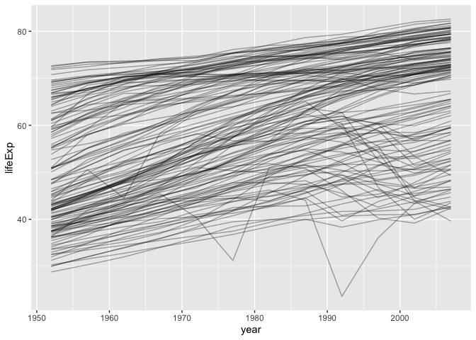<!-- -->

``` r
# single country - New Zealand 
nz <- filter(gapminder, country == "New Zealand")
nz %>% 
    ggplot(aes(year, lifeExp)) + 
    geom_line() + 
    ggtitle("Full data = ")
```

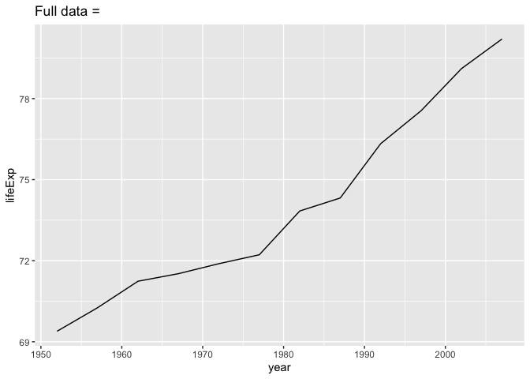<!-- -->

``` r
nz_mod <- lm(lifeExp ~ year, data = nz)
nz %>% 
    add_predictions(nz_mod) %>%
    ggplot(aes(year, pred)) + 
    geom_line() + 
    ggtitle("Linear trend + ")
```

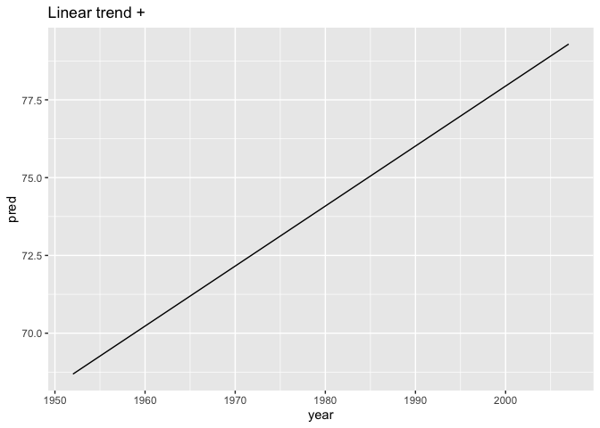<!-- -->

``` r
nz %>% 
    add_residuals(nz_mod) %>% 
    ggplot(aes(year, resid)) + 
    geom_hline(yintercept = 0, colour = "white", size = 3) + 
    geom_line() + 
    ggtitle("Remaining pattern")
```

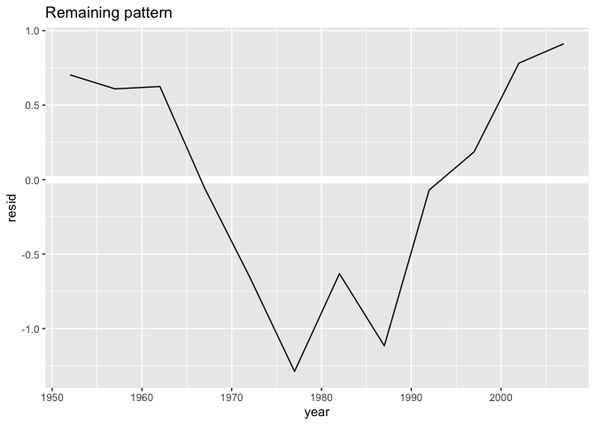<!-- -->

nested data

``` r
by_country <- gapminder %>% 
    group_by(country, continent) %>% 
    nest()
by_country
```

    ## # A tibble: 142 x 3
    ## # Groups:   country, continent [142]
    ##    country     continent data             
    ##    <fct>       <fct>     <list>           
    ##  1 Afghanistan Asia      <tibble [12 × 4]>
    ##  2 Albania     Europe    <tibble [12 × 4]>
    ##  3 Algeria     Africa    <tibble [12 × 4]>
    ##  4 Angola      Africa    <tibble [12 × 4]>
    ##  5 Argentina   Americas  <tibble [12 × 4]>
    ##  6 Australia   Oceania   <tibble [12 × 4]>
    ##  7 Austria     Europe    <tibble [12 × 4]>
    ##  8 Bahrain     Asia      <tibble [12 × 4]>
    ##  9 Bangladesh  Asia      <tibble [12 × 4]>
    ## 10 Belgium     Europe    <tibble [12 × 4]>
    ## # … with 132 more rows

just Afghanistan

``` r
by_country[[1,3]]
```

    ## [[1]]
    ## # A tibble: 12 x 4
    ##     year lifeExp      pop gdpPercap
    ##    <int>   <dbl>    <int>     <dbl>
    ##  1  1952    28.8  8425333      779.
    ##  2  1957    30.3  9240934      821.
    ##  3  1962    32.0 10267083      853.
    ##  4  1967    34.0 11537966      836.
    ##  5  1972    36.1 13079460      740.
    ##  6  1977    38.4 14880372      786.
    ##  7  1982    39.9 12881816      978.
    ##  8  1987    40.8 13867957      852.
    ##  9  1992    41.7 16317921      649.
    ## 10  1997    41.8 22227415      635.
    ## 11  2002    42.1 25268405      727.
    ## 12  2007    43.8 31889923      975.

list-columns

``` r
country_model <- function(df) {
    lm(lifeExp ~ year, data = df)
}
by_country <- by_country %>% 
    mutate(model = map(data, country_model))
by_country
```

    ## # A tibble: 142 x 4
    ## # Groups:   country, continent [142]
    ##    country     continent data              model 
    ##    <fct>       <fct>     <list>            <list>
    ##  1 Afghanistan Asia      <tibble [12 × 4]> <lm>  
    ##  2 Albania     Europe    <tibble [12 × 4]> <lm>  
    ##  3 Algeria     Africa    <tibble [12 × 4]> <lm>  
    ##  4 Angola      Africa    <tibble [12 × 4]> <lm>  
    ##  5 Argentina   Americas  <tibble [12 × 4]> <lm>  
    ##  6 Australia   Oceania   <tibble [12 × 4]> <lm>  
    ##  7 Austria     Europe    <tibble [12 × 4]> <lm>  
    ##  8 Bahrain     Asia      <tibble [12 × 4]> <lm>  
    ##  9 Bangladesh  Asia      <tibble [12 × 4]> <lm>  
    ## 10 Belgium     Europe    <tibble [12 × 4]> <lm>  
    ## # … with 132 more rows

``` r
by_country %>% 
    filter(continent == "Oceania")
```

    ## # A tibble: 2 x 4
    ## # Groups:   country, continent [2]
    ##   country     continent data              model 
    ##   <fct>       <fct>     <list>            <list>
    ## 1 Australia   Oceania   <tibble [12 × 4]> <lm>  
    ## 2 New Zealand Oceania   <tibble [12 × 4]> <lm>

``` r
by_country %>% 
    arrange(continent, country)
```

    ## # A tibble: 142 x 4
    ## # Groups:   country, continent [142]
    ##    country                  continent data              model 
    ##    <fct>                    <fct>     <list>            <list>
    ##  1 Algeria                  Africa    <tibble [12 × 4]> <lm>  
    ##  2 Angola                   Africa    <tibble [12 × 4]> <lm>  
    ##  3 Benin                    Africa    <tibble [12 × 4]> <lm>  
    ##  4 Botswana                 Africa    <tibble [12 × 4]> <lm>  
    ##  5 Burkina Faso             Africa    <tibble [12 × 4]> <lm>  
    ##  6 Burundi                  Africa    <tibble [12 × 4]> <lm>  
    ##  7 Cameroon                 Africa    <tibble [12 × 4]> <lm>  
    ##  8 Central African Republic Africa    <tibble [12 × 4]> <lm>  
    ##  9 Chad                     Africa    <tibble [12 × 4]> <lm>  
    ## 10 Comoros                  Africa    <tibble [12 × 4]> <lm>  
    ## # … with 132 more rows

unnesting

add residuals for each model-data pair

``` r
by_country <- by_country %>% 
    mutate(
        resids = map2(data, model, add_residuals)
    )
by_country
```

    ## # A tibble: 142 x 5
    ## # Groups:   country, continent [142]
    ##    country     continent data              model  resids           
    ##    <fct>       <fct>     <list>            <list> <list>           
    ##  1 Afghanistan Asia      <tibble [12 × 4]> <lm>   <tibble [12 × 5]>
    ##  2 Albania     Europe    <tibble [12 × 4]> <lm>   <tibble [12 × 5]>
    ##  3 Algeria     Africa    <tibble [12 × 4]> <lm>   <tibble [12 × 5]>
    ##  4 Angola      Africa    <tibble [12 × 4]> <lm>   <tibble [12 × 5]>
    ##  5 Argentina   Americas  <tibble [12 × 4]> <lm>   <tibble [12 × 5]>
    ##  6 Australia   Oceania   <tibble [12 × 4]> <lm>   <tibble [12 × 5]>
    ##  7 Austria     Europe    <tibble [12 × 4]> <lm>   <tibble [12 × 5]>
    ##  8 Bahrain     Asia      <tibble [12 × 4]> <lm>   <tibble [12 × 5]>
    ##  9 Bangladesh  Asia      <tibble [12 × 4]> <lm>   <tibble [12 × 5]>
    ## 10 Belgium     Europe    <tibble [12 × 4]> <lm>   <tibble [12 × 5]>
    ## # … with 132 more rows

just Afghanistan

``` r
by_country[[1,5]]
```

    ## [[1]]
    ## # A tibble: 12 x 5
    ##     year lifeExp      pop gdpPercap   resid
    ##    <int>   <dbl>    <int>     <dbl>   <dbl>
    ##  1  1952    28.8  8425333      779. -1.11  
    ##  2  1957    30.3  9240934      821. -0.952 
    ##  3  1962    32.0 10267083      853. -0.664 
    ##  4  1967    34.0 11537966      836. -0.0172
    ##  5  1972    36.1 13079460      740.  0.674 
    ##  6  1977    38.4 14880372      786.  1.65  
    ##  7  1982    39.9 12881816      978.  1.69  
    ##  8  1987    40.8 13867957      852.  1.28  
    ##  9  1992    41.7 16317921      649.  0.754 
    ## 10  1997    41.8 22227415      635. -0.534 
    ## 11  2002    42.1 25268405      727. -1.54  
    ## 12  2007    43.8 31889923      975. -1.22

use unnest to extract back to regular data frame

``` r
resids <- unnest(by_country, resids)
resids
```

    ## # A tibble: 1,704 x 9
    ## # Groups:   country, continent [142]
    ##    country   continent data        model   year lifeExp    pop gdpPercap   resid
    ##    <fct>     <fct>     <list>      <list> <int>   <dbl>  <int>     <dbl>   <dbl>
    ##  1 Afghanis… Asia      <tibble [1… <lm>    1952    28.8 8.43e6      779. -1.11  
    ##  2 Afghanis… Asia      <tibble [1… <lm>    1957    30.3 9.24e6      821. -0.952 
    ##  3 Afghanis… Asia      <tibble [1… <lm>    1962    32.0 1.03e7      853. -0.664 
    ##  4 Afghanis… Asia      <tibble [1… <lm>    1967    34.0 1.15e7      836. -0.0172
    ##  5 Afghanis… Asia      <tibble [1… <lm>    1972    36.1 1.31e7      740.  0.674 
    ##  6 Afghanis… Asia      <tibble [1… <lm>    1977    38.4 1.49e7      786.  1.65  
    ##  7 Afghanis… Asia      <tibble [1… <lm>    1982    39.9 1.29e7      978.  1.69  
    ##  8 Afghanis… Asia      <tibble [1… <lm>    1987    40.8 1.39e7      852.  1.28  
    ##  9 Afghanis… Asia      <tibble [1… <lm>    1992    41.7 1.63e7      649.  0.754 
    ## 10 Afghanis… Asia      <tibble [1… <lm>    1997    41.8 2.22e7      635. -0.534 
    ## # … with 1,694 more rows

plot residuals grouped by country

``` r
resids %>% 
    ggplot(aes(year, resid)) +
    geom_line(aes(group = country), alpha = 0.33) + 
    geom_smooth(se = FALSE)
```

    ## `geom_smooth()` using method = 'gam' and formula 'y ~ s(x, bs = "cs")'

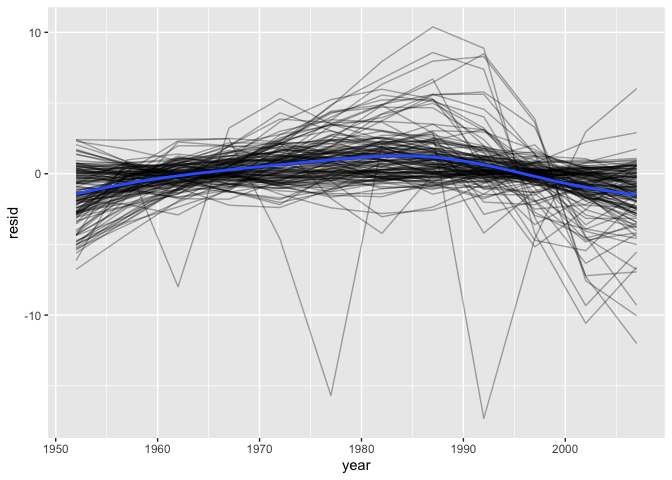<!-- -->

facet by continent

``` r
resids %>% 
    ggplot(aes(year, resid, group = country)) +
    geom_line(alpha = 1 / 3) + 
    facet_wrap(~continent)
```

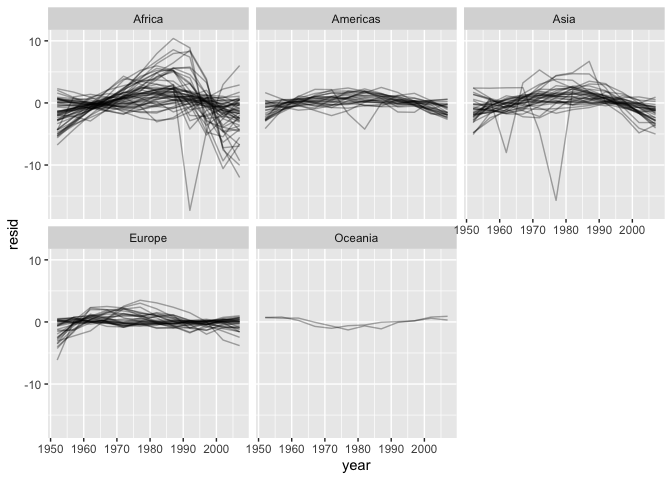<!-- -->

model quality

broom::glance extracts model quality metrics

``` r
glance(nz_mod)
```

    ## # A tibble: 1 x 12
    ##   r.squared adj.r.squared sigma statistic p.value    df logLik   AIC   BIC
    ##       <dbl>         <dbl> <dbl>     <dbl>   <dbl> <dbl>  <dbl> <dbl> <dbl>
    ## 1     0.954         0.949 0.804      205. 5.41e-8     1  -13.3  32.6  34.1
    ## # … with 3 more variables: deviance <dbl>, df.residual <int>, nobs <int>

``` r
by_country %>% 
    mutate(glance = map(model, glance)) %>% 
    unnest(glance)
```

    ## # A tibble: 142 x 17
    ## # Groups:   country, continent [142]
    ##    country continent data  model resids r.squared adj.r.squared sigma statistic
    ##    <fct>   <fct>     <lis> <lis> <list>     <dbl>         <dbl> <dbl>     <dbl>
    ##  1 Afghan… Asia      <tib… <lm>  <tibb…     0.948         0.942 1.22      181. 
    ##  2 Albania Europe    <tib… <lm>  <tibb…     0.911         0.902 1.98      102. 
    ##  3 Algeria Africa    <tib… <lm>  <tibb…     0.985         0.984 1.32      662. 
    ##  4 Angola  Africa    <tib… <lm>  <tibb…     0.888         0.877 1.41       79.1
    ##  5 Argent… Americas  <tib… <lm>  <tibb…     0.996         0.995 0.292    2246. 
    ##  6 Austra… Oceania   <tib… <lm>  <tibb…     0.980         0.978 0.621     481. 
    ##  7 Austria Europe    <tib… <lm>  <tibb…     0.992         0.991 0.407    1261. 
    ##  8 Bahrain Asia      <tib… <lm>  <tibb…     0.967         0.963 1.64      291. 
    ##  9 Bangla… Asia      <tib… <lm>  <tibb…     0.989         0.988 0.977     930. 
    ## 10 Belgium Europe    <tib… <lm>  <tibb…     0.995         0.994 0.293    1822. 
    ## # … with 132 more rows, and 8 more variables: p.value <dbl>, df <dbl>,
    ## #   logLik <dbl>, AIC <dbl>, BIC <dbl>, deviance <dbl>, df.residual <int>,
    ## #   nobs <int>

``` r
glance <- by_country %>% 
    mutate(glance = map(model, glance)) %>% 
    unnest(glance, .drop = TRUE)
```

    ## Warning: The `.drop` argument of `unnest()` is deprecated as of tidyr 1.0.0.
    ## All list-columns are now preserved.
    ## This warning is displayed once every 8 hours.
    ## Call `lifecycle::last_warnings()` to see where this warning was generated.

``` r
glance
```

    ## # A tibble: 142 x 17
    ## # Groups:   country, continent [142]
    ##    country continent data  model resids r.squared adj.r.squared sigma statistic
    ##    <fct>   <fct>     <lis> <lis> <list>     <dbl>         <dbl> <dbl>     <dbl>
    ##  1 Afghan… Asia      <tib… <lm>  <tibb…     0.948         0.942 1.22      181. 
    ##  2 Albania Europe    <tib… <lm>  <tibb…     0.911         0.902 1.98      102. 
    ##  3 Algeria Africa    <tib… <lm>  <tibb…     0.985         0.984 1.32      662. 
    ##  4 Angola  Africa    <tib… <lm>  <tibb…     0.888         0.877 1.41       79.1
    ##  5 Argent… Americas  <tib… <lm>  <tibb…     0.996         0.995 0.292    2246. 
    ##  6 Austra… Oceania   <tib… <lm>  <tibb…     0.980         0.978 0.621     481. 
    ##  7 Austria Europe    <tib… <lm>  <tibb…     0.992         0.991 0.407    1261. 
    ##  8 Bahrain Asia      <tib… <lm>  <tibb…     0.967         0.963 1.64      291. 
    ##  9 Bangla… Asia      <tib… <lm>  <tibb…     0.989         0.988 0.977     930. 
    ## 10 Belgium Europe    <tib… <lm>  <tibb…     0.995         0.994 0.293    1822. 
    ## # … with 132 more rows, and 8 more variables: p.value <dbl>, df <dbl>,
    ## #   logLik <dbl>, AIC <dbl>, BIC <dbl>, deviance <dbl>, df.residual <int>,
    ## #   nobs <int>

``` r
glance %>% 
    arrange(r.squared)
```

    ## # A tibble: 142 x 17
    ## # Groups:   country, continent [142]
    ##    country continent data  model resids r.squared adj.r.squared sigma statistic
    ##    <fct>   <fct>     <lis> <lis> <list>     <dbl>         <dbl> <dbl>     <dbl>
    ##  1 Rwanda  Africa    <tib… <lm>  <tibb…    0.0172      -0.0811   6.56     0.175
    ##  2 Botswa… Africa    <tib… <lm>  <tibb…    0.0340      -0.0626   6.11     0.352
    ##  3 Zimbab… Africa    <tib… <lm>  <tibb…    0.0562      -0.0381   7.21     0.596
    ##  4 Zambia  Africa    <tib… <lm>  <tibb…    0.0598      -0.0342   4.53     0.636
    ##  5 Swazil… Africa    <tib… <lm>  <tibb…    0.0682      -0.0250   6.64     0.732
    ##  6 Lesotho Africa    <tib… <lm>  <tibb…    0.0849      -0.00666  5.93     0.927
    ##  7 Cote d… Africa    <tib… <lm>  <tibb…    0.283        0.212    3.93     3.95 
    ##  8 South … Africa    <tib… <lm>  <tibb…    0.312        0.244    4.74     4.54 
    ##  9 Uganda  Africa    <tib… <lm>  <tibb…    0.342        0.276    3.19     5.20 
    ## 10 Congo,… Africa    <tib… <lm>  <tibb…    0.348        0.283    2.43     5.34 
    ## # … with 132 more rows, and 8 more variables: p.value <dbl>, df <dbl>,
    ## #   logLik <dbl>, AIC <dbl>, BIC <dbl>, deviance <dbl>, df.residual <int>,
    ## #   nobs <int>

``` r
glance %>% 
    ggplot(aes(continent, r.squared)) + 
    geom_jitter(width = 0.5)
```

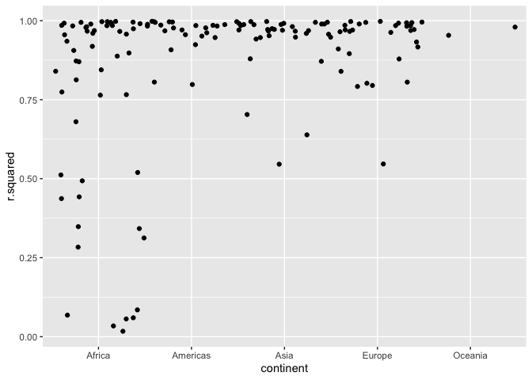<!-- -->

``` r
bad_fit <- filter(glance, r.squared < 0.25)
gapminder %>% 
    semi_join(bad_fit, by = "country") %>% 
    ggplot(aes(year, lifeExp, colour = country)) +
    geom_line()
```

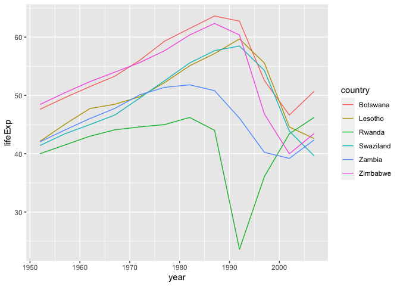<!-- -->

We see two main effects here: the tragedies of the HIV/AIDS epidemic and
the Rwandan genocide.

### 25.2 Exercises

A linear trend seems to be slightly too simple for the overall trend.
Can you do better with a quadratic polynomial? How can you interpret the
coefficients of the quadratic? (Hint you might want to transform year so
that it has mean zero.)

``` r
rm(glance)
by_country <- gapminder %>% 
    group_by(country, continent) %>% 
    nest()
country_model_poly <- function(df) {
    lm(lifeExp ~ poly(year - mean(year), 2), data = df)
}
by_country <- by_country %>% 
    mutate(model = map(data, country_model_poly))
by_country <- by_country %>% 
    mutate(resids = map2(data, model, add_residuals))
resids <- unnest(by_country, resids)
```

plot residuals for poly model grouped by country

``` r
resids %>% 
    ggplot(aes(year, resid)) +
    geom_line(aes(group = country), alpha = 0.33) + 
    geom_smooth(se = FALSE)
```

    ## `geom_smooth()` using method = 'gam' and formula 'y ~ s(x, bs = "cs")'

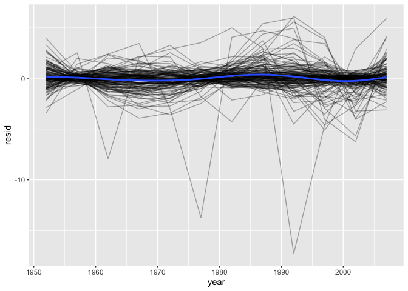<!-- -->

get poly model quality measures

``` r
by_country %>% 
    mutate(glance = map(model, glance)) %>% 
    unnest(glance)
```

    ## # A tibble: 142 x 17
    ## # Groups:   country, continent [142]
    ##    country continent data  model resids r.squared adj.r.squared sigma statistic
    ##    <fct>   <fct>     <lis> <lis> <list>     <dbl>         <dbl> <dbl>     <dbl>
    ##  1 Afghan… Asia      <tib… <lm>  <tibb…     0.989         0.987 0.586      412.
    ##  2 Albania Europe    <tib… <lm>  <tibb…     0.962         0.953 1.37       113.
    ##  3 Algeria Africa    <tib… <lm>  <tibb…     0.992         0.990 1.02       561.
    ##  4 Angola  Africa    <tib… <lm>  <tibb…     0.979         0.974 0.647      206.
    ##  5 Argent… Americas  <tib… <lm>  <tibb…     0.996         0.995 0.307     1015.
    ##  6 Austra… Oceania   <tib… <lm>  <tibb…     0.993         0.991 0.392      612.
    ##  7 Austria Europe    <tib… <lm>  <tibb…     0.995         0.993 0.355      831.
    ##  8 Bahrain Asia      <tib… <lm>  <tibb…     0.997         0.997 0.491     1672.
    ##  9 Bangla… Asia      <tib… <lm>  <tibb…     0.997         0.997 0.521     1648.
    ## 10 Belgium Europe    <tib… <lm>  <tibb…     0.996         0.995 0.272     1054.
    ## # … with 132 more rows, and 8 more variables: p.value <dbl>, df <dbl>,
    ## #   logLik <dbl>, AIC <dbl>, BIC <dbl>, deviance <dbl>, df.residual <int>,
    ## #   nobs <int>

``` r
glance <- by_country %>% 
    mutate(glance = map(model, glance)) %>% 
    unnest(glance, .drop = TRUE)
glance %>% 
    arrange(r.squared)
```

    ## # A tibble: 142 x 17
    ## # Groups:   country, continent [142]
    ##    country continent data  model resids r.squared adj.r.squared sigma statistic
    ##    <fct>   <fct>     <lis> <lis> <list>     <dbl>         <dbl> <dbl>     <dbl>
    ##  1 Rwanda  Africa    <tib… <lm>  <tibb…    0.0174        -0.201  6.91    0.0795
    ##  2 Liberia Africa    <tib… <lm>  <tibb…    0.613          0.527  1.66    7.12  
    ##  3 Uganda  Africa    <tib… <lm>  <tibb…    0.640          0.561  2.48    8.02  
    ##  4 Cambod… Asia      <tib… <lm>  <tibb…    0.682          0.611  5.57    9.65  
    ##  5 Botswa… Africa    <tib… <lm>  <tibb…    0.694          0.626  3.63   10.2   
    ##  6 Lesotho Africa    <tib… <lm>  <tibb…    0.704          0.638  3.56   10.7   
    ##  7 Zimbab… Africa    <tib… <lm>  <tibb…    0.711          0.647  4.20   11.1   
    ##  8 Zambia  Africa    <tib… <lm>  <tibb…    0.729          0.668  2.57   12.1   
    ##  9 Congo,… Africa    <tib… <lm>  <tibb…    0.730          0.669  1.65   12.1   
    ## 10 Swazil… Africa    <tib… <lm>  <tibb…    0.731          0.671  3.76   12.2   
    ## # … with 132 more rows, and 8 more variables: p.value <dbl>, df <dbl>,
    ## #   logLik <dbl>, AIC <dbl>, BIC <dbl>, deviance <dbl>, df.residual <int>,
    ## #   nobs <int>

``` r
glance %>% 
    ggplot(aes(continent, r.squared)) + 
    geom_jitter(width = 0.5)
```

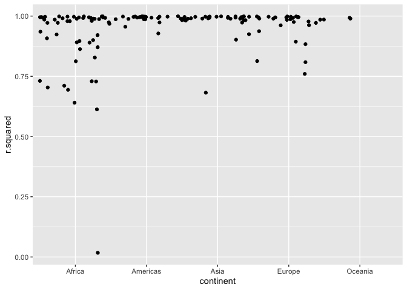<!-- -->

only Rwanda - *genocide impact* - remains distant outlier though there
are other African countries and Cambodia that don’t fit all that well
(Rsq &lt; 0.75)

Explore other methods for visualising the distribution of Rsq per
continent. You might want to try the ggbeeswarm package, which provides
similar methods for avoiding overlaps as jitter, but uses deterministic
methods.

``` r
library("ggbeeswarm")
glance %>%
    ggplot(aes(continent, r.squared)) +
    geom_beeswarm()
```

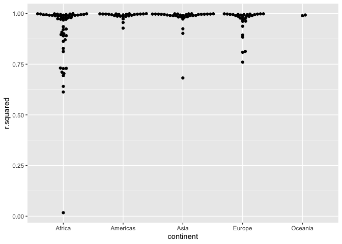<!-- -->

To create the last plot (showing the data for the countries with the
worst model fits), we needed two steps: we created a data frame with one
row per country and then semi-joined it to the original dataset. It’s
possible to avoid this join if we use unnest() instead of unnest(.drop =
TRUE). How?

``` r
rm(glance)
by_country <- gapminder %>% 
    group_by(country, continent) %>% 
    nest() %>% 
    mutate(
        model = map(data, ~lm(lifeExp ~ poly(year - mean(year), 2), .)),
        glance = map(model, glance)
    ) %>% 
    unnest(glance) %>%
    unnest(data) %>% # if you don't drop data, the values can by unnested inline
    filter(r.squared < 0.75)
by_country %>% 
    ggplot(aes(year, lifeExp, color = country)) +
    geom_line()
```

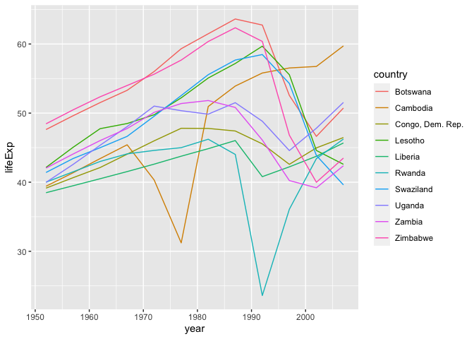<!-- -->
