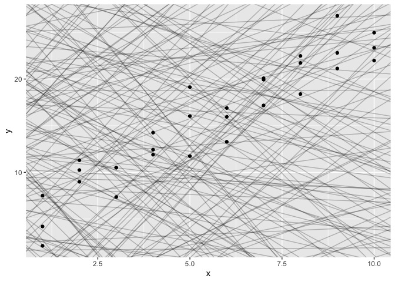
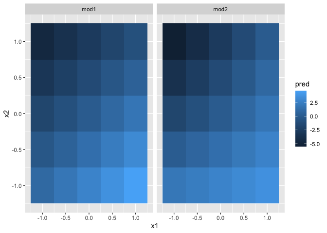
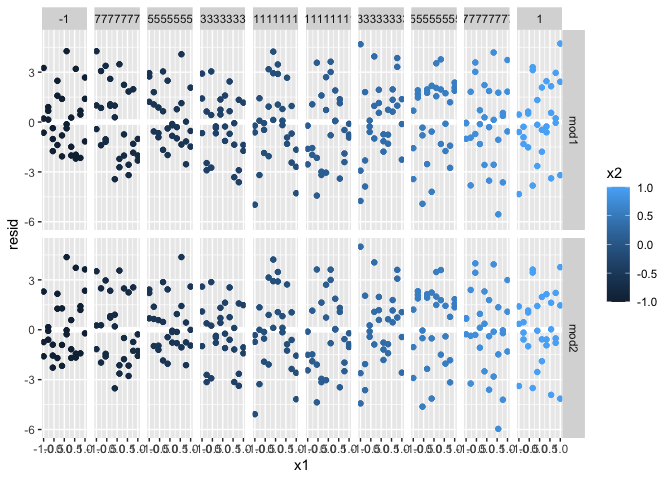
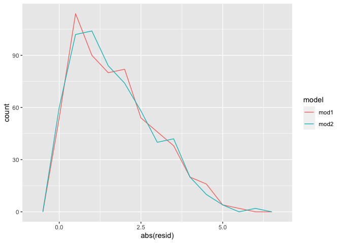

R4DS Model Section: Model Basics Chapter
================
H. David Shea
28 January 2021

## 23.2 a simple model

``` r
ggplot(sim1, aes(x, y)) + 
    geom_point()
```

<!-- -->

``` r
models <- tibble(
    a1 = runif(250, -20, 40),
    a2 = runif(250, -5, 5)
)

ggplot(sim1, aes(x, y)) + 
    geom_abline(aes(intercept = a1, slope = a2), data = models, alpha = 1/4) +
    geom_point() 
```

<!-- -->

``` r
model1 <- function(a, data) {
    a[1] + data$x * a[2]
}
model1(c(7, 1.5), sim1)
```

    ##  [1]  8.5  8.5  8.5 10.0 10.0 10.0 11.5 11.5 11.5 13.0 13.0 13.0 14.5 14.5 14.5
    ## [16] 16.0 16.0 16.0 17.5 17.5 17.5 19.0 19.0 19.0 20.5 20.5 20.5 22.0 22.0 22.0

``` r
measure_distance <- function(mod, data) {
    diff <- data$y - model1(mod, data)
    sqrt(mean(diff ^ 2))
}
measure_distance(c(7, 1.5), sim1)
```

    ## [1] 2.665212

``` r
sim1_dist <- function(a1, a2) {
    measure_distance(c(a1, a2), sim1)
}

models <- models %>% 
    mutate(dist = purrr::map2_dbl(a1, a2, sim1_dist))
models
```

    ## # A tibble: 250 x 3
    ##        a1     a2  dist
    ##     <dbl>  <dbl> <dbl>
    ##  1 -16.1  -1.93  43.8 
    ##  2 -13.5   0.142 28.8 
    ##  3  33.2  -4.87  21.9 
    ##  4  27.6   4.40  37.0 
    ##  5  -4.82  1.12  14.6 
    ##  6  12.2  -0.393  9.18
    ##  7  21.4  -3.04  18.3 
    ##  8   8.40 -0.154 10.4 
    ##  9 -19.7   4.27  13.5 
    ## 10 -11.2   4.38   7.50
    ## # … with 240 more rows

``` r
ggplot(sim1, aes(x, y)) + 
    geom_point(size = 2, color = "grey30") + 
    geom_abline(
        aes(intercept = a1, slope = a2, color = -dist), 
        data = filter(models, rank(dist) <= 10)
    )
```

<!-- -->

``` r
filter(models, rank(dist) <= 10)
```

    ## # A tibble: 10 x 3
    ##       a1    a2  dist
    ##    <dbl> <dbl> <dbl>
    ##  1 10.0  1.50   3.82
    ##  2 -3.16 2.91   4.20
    ##  3  8.46 1.46   2.90
    ##  4  4.33 1.39   4.52
    ##  5  7.41 1.98   3.53
    ##  6 -1.53 2.57   3.89
    ##  7 -4.10 3.22   4.40
    ##  8  6.56 1.43   2.97
    ##  9  4.04 2.75   4.70
    ## 10 13.2  0.997  4.88

``` r
ggplot(models, aes(a1, a2)) +
    geom_point(data = filter(models, rank(dist) <= 10), size = 4, color = "red") +
    geom_point(aes(color = -dist))
```

<!-- -->

``` r
grid <- expand.grid(
    a1 = seq(-5, 20, length = 25),
    a2 = seq(1, 3, length = 25)
    ) %>% 
    mutate(dist = purrr::map2_dbl(a1, a2, sim1_dist))

grid %>% 
    ggplot(aes(a1, a2)) +
    geom_point(data = filter(grid, rank(dist) <= 10), size = 4, color = "red") +
    geom_point(aes(color = -dist))
```

<!-- -->

``` r
ggplot(sim1, aes(x, y)) + 
    geom_point(size = 2, color = "grey30") + 
    geom_abline(
        aes(intercept = a1, slope = a2, color = -dist), 
        data = filter(grid, rank(dist) <= 10)
    )
```

<!-- -->

``` r
best <- optim(c(0, 0), measure_distance, data = sim1)
best$par
```

    ## [1] 4.222248 2.051204

``` r
ggplot(sim1, aes(x, y)) + 
    geom_point(size = 2, color = "grey30") + 
    geom_abline(intercept = best$par[1], slope = best$par[2])
```

<!-- -->

``` r
sim1_mod <- lm(y ~ x, data = sim1)
coef(sim1_mod)
```

    ## (Intercept)           x 
    ##    4.220822    2.051533

### 23.2 Exercises

One downside of the linear model is that it is sensitive to unusual
values because the distance incorporates a squared term. Fit a linear
model to the simulated data below, and visualise the results. Rerun a
few times to generate different simulated datasets. What do you notice
about the model?

``` r
sim1a <- tibble(
    x = rep(1:10, each = 3),
    y = x * 1.5 + 6 + rt(length(x), df = 2)
)

sim1a_mod <- lm(y ~ x, data = sim1a)
coef(sim1a_mod)
```

    ## (Intercept)           x 
    ##    6.681368    1.419003

``` r
ggplot(sim1a, aes(x, y)) + 
    geom_point(size = 2, color = "grey30") + 
    geom_abline(intercept = coef(sim1a_mod)[1], slope = coef(sim1a_mod)[2])
```

<!-- -->

One way to make linear models more robust is to use a different distance
measure. For example, instead of root-mean-squared distance, you could
use mean-absolute distance:

``` r
measure_distance2 <- function(mod, data) {
    diff <- data$y - model1(mod, data)
    mean(abs(diff))
}

sim1a <- tibble(
    x = rep(1:10, each = 3),
    y = x * 1.5 + 6 + rt(length(x), df = 2)
)

sim1a_mod <- lm(y ~ x, data = sim1a)
coef(sim1a_mod)
```

    ## (Intercept)           x 
    ##    6.405458    1.369674

``` r
best <- optim(c(0, 0), measure_distance2, data = sim1a)
best$par
```

    ## [1] 5.581411 1.546630

``` r
ggplot(sim1a, aes(x, y)) + 
    geom_point(size = 2, color = "grey30") + 
    geom_abline(intercept = coef(sim1a_mod)[1], slope = coef(sim1a_mod)[2]) +
    geom_abline(intercept = best$par[1], slope = best$par[2])
```

<!-- -->

## 23.3 visualizing models

It’s also useful to see what the model doesn’t capture, the so-called
residuals which are left after subtracting the predictions from the
data. Residuals are powerful because they allow us to use models to
remove striking patterns so we can study the subtler trends that remain.

``` r
grid <- sim1 %>% 
    data_grid(x) 
grid
```

    ## # A tibble: 10 x 1
    ##        x
    ##    <int>
    ##  1     1
    ##  2     2
    ##  3     3
    ##  4     4
    ##  5     5
    ##  6     6
    ##  7     7
    ##  8     8
    ##  9     9
    ## 10    10

``` r
sim1_mod <- lm(y ~ x, data = sim1)

grid <- grid %>% 
    add_predictions(sim1_mod) 
grid
```

    ## # A tibble: 10 x 2
    ##        x  pred
    ##    <int> <dbl>
    ##  1     1  6.27
    ##  2     2  8.32
    ##  3     3 10.4 
    ##  4     4 12.4 
    ##  5     5 14.5 
    ##  6     6 16.5 
    ##  7     7 18.6 
    ##  8     8 20.6 
    ##  9     9 22.7 
    ## 10    10 24.7

``` r
ggplot(sim1, aes(x)) +
    geom_point(aes(y = y)) +
    geom_line(aes(y = pred), data = grid, color = "red", size = 1)
```

<!-- -->

``` r
sim1 <- sim1 %>% 
    add_residuals(sim1_mod)
sim1
```

    ## # A tibble: 30 x 3
    ##        x     y    resid
    ##    <int> <dbl>    <dbl>
    ##  1     1  4.20 -2.07   
    ##  2     1  7.51  1.24   
    ##  3     1  2.13 -4.15   
    ##  4     2  8.99  0.665  
    ##  5     2 10.2   1.92   
    ##  6     2 11.3   2.97   
    ##  7     3  7.36 -3.02   
    ##  8     3 10.5   0.130  
    ##  9     3 10.5   0.136  
    ## 10     4 12.4   0.00763
    ## # … with 20 more rows

freqpoly of residuals from lm(y \~ x)

``` r
ggplot(sim1, aes(resid)) + 
    geom_freqpoly(binwidth = 0.5)
```

<!-- -->

plot of residuals from lm(y \~x)

``` r
ggplot(sim1, aes(x, resid)) + 
    geom_ref_line(h = 0) +
    geom_point() 
```

<!-- -->

### 23.3 Exercises

Instead of using lm() to fit a straight line, you can use loess() to fit
a smooth curve. Repeat the process of model fitting, grid generation,
predictions, and visualisation on sim1 using loess() instead of lm().
How does the result compare to geom\_smooth()?

``` r
grid_ls <- sim1 %>% 
    data_grid(x) 
grid_ls
```

    ## # A tibble: 10 x 1
    ##        x
    ##    <int>
    ##  1     1
    ##  2     2
    ##  3     3
    ##  4     4
    ##  5     5
    ##  6     6
    ##  7     7
    ##  8     8
    ##  9     9
    ## 10    10

``` r
sim1_mod_ls <- loess(y ~ x, data = sim1)

grid_ls <- grid_ls %>% 
    add_predictions(sim1_mod_ls) 
grid_ls
```

    ## # A tibble: 10 x 2
    ##        x  pred
    ##    <int> <dbl>
    ##  1     1  5.34
    ##  2     2  8.27
    ##  3     3 10.8 
    ##  4     4 12.8 
    ##  5     5 14.6 
    ##  6     6 16.6 
    ##  7     7 18.7 
    ##  8     8 20.8 
    ##  9     9 22.6 
    ## 10    10 24.0

``` r
ggplot(sim1, aes(x)) +
    geom_point(aes(y = y)) +
    geom_smooth(aes(y = y), size = 3) +
    geom_line(aes(y = pred), data = grid, color = "red", size = 1) +
    geom_line(aes(y = pred), data = grid_ls, color = "green", size = 1)
```

    ## `geom_smooth()` using method = 'loess' and formula 'y ~ x'

<!-- -->

Why might you want to look at a frequency polygon of absolute residuals?
What are the pros and cons compared to looking at the raw residuals?

freqpoly of residuals from lm(y \~ x)

``` r
ggplot(sim1) + 
    geom_freqpoly(aes(resid), binwidth = 0.5) + 
    geom_freqpoly(aes(abs(resid)), binwidth = 0.5, color = "red")
```

<!-- -->

## 23.4 formulas and model families

categorical variables

``` r
ggplot(sim2) + 
    geom_point(aes(x, y))
```

<!-- -->

``` r
mod2 <- lm(y ~ x, data = sim2)

grid <- sim2 %>% 
    data_grid(x) %>% 
    add_predictions(mod2)
grid
```

    ## # A tibble: 4 x 2
    ##   x      pred
    ##   <chr> <dbl>
    ## 1 a      1.15
    ## 2 b      8.12
    ## 3 c      6.13
    ## 4 d      1.91

Effectively, a model with a categorical x will predict the mean value
for each category. (Why? Because the mean minimises the
root-mean-squared distance.)

``` r
ggplot(sim2, aes(x)) + 
    geom_point(aes(y = y)) +
    geom_point(data = grid, aes(y = pred), color = "red", size = 4)
```

<!-- -->

interactions (continuous and categorical)

``` r
ggplot(sim3, aes(x1, y)) + 
    geom_point(aes(color = x2))
```

<!-- -->

note ‘+’ in mod1 and ’\*’ in mod2

``` r
mod1 <- lm(y ~ x1 + x2, data = sim3)
mod2 <- lm(y ~ x1 * x2, data = sim3)

grid <- sim3 %>% 
    data_grid(x1, x2) %>% 
    gather_predictions(mod1, mod2)
grid
```

    ## # A tibble: 80 x 4
    ##    model    x1 x2     pred
    ##    <chr> <int> <fct> <dbl>
    ##  1 mod1      1 a      1.67
    ##  2 mod1      1 b      4.56
    ##  3 mod1      1 c      6.48
    ##  4 mod1      1 d      4.03
    ##  5 mod1      2 a      1.48
    ##  6 mod1      2 b      4.37
    ##  7 mod1      2 c      6.28
    ##  8 mod1      2 d      3.84
    ##  9 mod1      3 a      1.28
    ## 10 mod1      3 b      4.17
    ## # … with 70 more rows

``` r
ggplot(sim3, aes(x1, y, color = x2)) + 
    geom_point() + 
    geom_line(data = grid, aes(y = pred)) + 
    facet_wrap(~ model)
```

<!-- -->

``` r
sim3 <- sim3 %>% 
    gather_residuals(mod1, mod2)

ggplot(sim3, aes(x1, resid, color = x2)) + 
    geom_point() + 
    facet_grid(model ~ x2)
```

<!-- -->

There is little obvious pattern in the residuals for mod2. The residuals
for mod1 show that the model has clearly missed some pattern in b, and
less so, but still present is pattern in c, and d.  interactions (two
continuous)

``` r
mod1 <- lm(y ~ x1 + x2, data = sim4)
mod2 <- lm(y ~ x1 * x2, data = sim4)

grid <- sim4 %>% 
    data_grid(
        x1 = seq_range(x1, 5), 
        x2 = seq_range(x2, 5) 
    ) %>% 
    gather_predictions(mod1, mod2)
grid
```

    ## # A tibble: 50 x 4
    ##    model    x1    x2   pred
    ##    <chr> <dbl> <dbl>  <dbl>
    ##  1 mod1   -1    -1    0.996
    ##  2 mod1   -1    -0.5 -0.395
    ##  3 mod1   -1     0   -1.79 
    ##  4 mod1   -1     0.5 -3.18 
    ##  5 mod1   -1     1   -4.57 
    ##  6 mod1   -0.5  -1    1.91 
    ##  7 mod1   -0.5  -0.5  0.516
    ##  8 mod1   -0.5   0   -0.875
    ##  9 mod1   -0.5   0.5 -2.27 
    ## 10 mod1   -0.5   1   -3.66 
    ## # … with 40 more rows

Next let’s try and visualise that model. We have two continuous
predictors, so you can imagine the model like a 3d surface. We could
display that using geom\_tile():

``` r
ggplot(grid, aes(x1, x2)) + 
    geom_tile(aes(fill = pred)) + 
    facet_wrap(~ model)
```

<!-- -->

That doesn’t suggest that the models are very different! But that’s
partly an illusion: our eyes and brains are not very good at accurately
comparing shades of color. Instead of looking at the surface from the
top, we could look at it from either side, showing multiple slices:

``` r
ggplot(grid, aes(x1, pred, color = x2, group = x2)) + 
    geom_line() +
    facet_wrap(~ model)
```

<!-- -->

``` r
ggplot(grid, aes(x2, pred, color = x1, group = x1)) + 
    geom_line() +
    facet_wrap(~ model)
```

<!-- -->

residuals

``` r
sim4 <- sim4 %>% 
    gather_residuals(mod1, mod2)

ggplot(sim4, aes(x1, resid, color = x2)) + 
    geom_point() + 
    facet_grid(model ~ x2)
```

<!-- -->

transformations

``` r
df <- tribble(
    ~y, ~x,
    1,  1,
    2,  2, 
    3,  3
)
library(splines)
model_matrix(df, y ~ ns(x, 2)) # ns is natural spline function, second arg is degrees of freedom
```

    ## # A tibble: 3 x 3
    ##   `(Intercept)` `ns(x, 2)1` `ns(x, 2)2`
    ##           <dbl>       <dbl>       <dbl>
    ## 1             1       0           0    
    ## 2             1       0.566      -0.211
    ## 3             1       0.344       0.771

``` r
sim5 <- tibble(
    x = seq(0, 3.5 * pi, length = 50),
    y = 4 * sin(x) + rnorm(length(x))
)

ggplot(sim5, aes(x, y)) +
    geom_point()
```

<!-- -->

``` r
mod1 <- lm(y ~ ns(x, 1), data = sim5)
mod2 <- lm(y ~ ns(x, 2), data = sim5)
mod3 <- lm(y ~ ns(x, 3), data = sim5)
mod4 <- lm(y ~ ns(x, 4), data = sim5)
mod5 <- lm(y ~ ns(x, 5), data = sim5)

grid <- sim5 %>% 
    data_grid(x = seq_range(x, n = 50, expand = 0.1)) %>% 
    gather_predictions(mod1, mod2, mod3, mod4, mod5, .pred = "y")

ggplot(sim5, aes(x, y)) + 
    geom_point() +
    geom_line(data = grid, color = "red") +
    facet_wrap(~ model)
```

<!-- -->

Notice that the extrapolation outside the range of the data is clearly
bad. This is the downside to approximating a function with a polynomial.
But this is a very real problem with every model: the model can never
tell you if the behaviour is true when you start extrapolating outside
the range of the data that you have seen. You must rely on *theory* and
**science**. (Emphasis added by *president* Joe Biden.)

### 23.4 Exercises

What happens if you repeat the analysis of sim2 using a model without an
intercept. What happens to the model equation? What happens to the
predictions?

``` r
ggplot(sim2) + 
    geom_point(aes(x, y))
```

<!-- -->

``` r
mod2 <- lm(y ~ x, data = sim2)
mod2_no_int <- lm(y ~ x - 1, data = sim2)

grid <- sim2 %>% 
    data_grid(x) %>% 
    gather_predictions(mod2,mod2_no_int)
grid
```

    ## # A tibble: 8 x 3
    ##   model       x      pred
    ##   <chr>       <chr> <dbl>
    ## 1 mod2        a      1.15
    ## 2 mod2        b      8.12
    ## 3 mod2        c      6.13
    ## 4 mod2        d      1.91
    ## 5 mod2_no_int a      1.15
    ## 6 mod2_no_int b      8.12
    ## 7 mod2_no_int c      6.13
    ## 8 mod2_no_int d      1.91

exactly the same

Use model\_matrix() to explore the equations generated for the models I
fit to sim3 and sim4. Why is \* a good shorthand for interaction?

``` r
model_matrix(y ~ x1 * x2, data = sim3)
```

    ## # A tibble: 240 x 8
    ##    `(Intercept)`    x1   x2b   x2c   x2d `x1:x2b` `x1:x2c` `x1:x2d`
    ##            <dbl> <dbl> <dbl> <dbl> <dbl>    <dbl>    <dbl>    <dbl>
    ##  1             1     1     0     0     0        0        0        0
    ##  2             1     1     0     0     0        0        0        0
    ##  3             1     1     0     0     0        0        0        0
    ##  4             1     1     1     0     0        1        0        0
    ##  5             1     1     1     0     0        1        0        0
    ##  6             1     1     1     0     0        1        0        0
    ##  7             1     1     0     1     0        0        1        0
    ##  8             1     1     0     1     0        0        1        0
    ##  9             1     1     0     1     0        0        1        0
    ## 10             1     1     0     0     1        0        0        1
    ## # … with 230 more rows

``` r
model_matrix(y ~ x1 * x2, data = sim4)
```

    ## # A tibble: 600 x 4
    ##    `(Intercept)`    x1     x2 `x1:x2`
    ##            <dbl> <dbl>  <dbl>   <dbl>
    ##  1             1    -1 -1       1    
    ##  2             1    -1 -1       1    
    ##  3             1    -1 -1       1    
    ##  4             1    -1 -0.778   0.778
    ##  5             1    -1 -0.778   0.778
    ##  6             1    -1 -0.778   0.778
    ##  7             1    -1 -0.556   0.556
    ##  8             1    -1 -0.556   0.556
    ##  9             1    -1 -0.556   0.556
    ## 10             1    -1 -0.333   0.333
    ## # … with 590 more rows

For sim4, which of mod1 and mod2 is better? I think mod2 does a slightly
better job at removing patterns, but it’s pretty subtle. Can you come up
with a plot to support my claim?

``` r
mod1 <- lm(y ~ x1 + x2, data = sim4)
mod2 <- lm(y ~ x1 * x2, data = sim4)
```

predictions

``` r
grid <- sim4 %>% 
    data_grid(
        x1 = seq_range(x1, 5), 
        x2 = seq_range(x2, 5) 
    ) %>% 
    gather_predictions(mod1, mod2)
grid
```

    ## # A tibble: 50 x 4
    ##    model    x1    x2   pred
    ##    <chr> <dbl> <dbl>  <dbl>
    ##  1 mod1   -1    -1    0.996
    ##  2 mod1   -1    -0.5 -0.395
    ##  3 mod1   -1     0   -1.79 
    ##  4 mod1   -1     0.5 -3.18 
    ##  5 mod1   -1     1   -4.57 
    ##  6 mod1   -0.5  -1    1.91 
    ##  7 mod1   -0.5  -0.5  0.516
    ##  8 mod1   -0.5   0   -0.875
    ##  9 mod1   -0.5   0.5 -2.27 
    ## 10 mod1   -0.5   1   -3.66 
    ## # … with 40 more rows

residuals

``` r
sim4 <- sim4 %>% 
    gather_residuals(mod1, mod2)
sim4
```

    ## # A tibble: 1,200 x 6
    ##    model    x1     x2   rep       y  resid
    ##    <chr> <dbl>  <dbl> <int>   <dbl>  <dbl>
    ##  1 mod1     -1 -1         1  4.25    3.25 
    ##  2 mod1     -1 -1         2  1.21    0.210
    ##  3 mod1     -1 -1         3  0.353  -0.643
    ##  4 mod1     -1 -0.778     1 -0.0467 -0.425
    ##  5 mod1     -1 -0.778     2  4.64    4.26 
    ##  6 mod1     -1 -0.778     3  1.38    0.999
    ##  7 mod1     -1 -0.556     1  0.975   1.22 
    ##  8 mod1     -1 -0.556     2  2.50    2.74 
    ##  9 mod1     -1 -0.556     3  2.70    2.95 
    ## 10 mod1     -1 -0.333     1  0.558   1.42 
    ## # … with 1,190 more rows

nothing really jumps out in residual plots

raw

``` r
ggplot(sim4, aes(x1, resid, color = x2)) + 
    geom_ref_line(h = 0) +
    geom_point() + 
    facet_grid(model ~ x2)
```

<!-- -->

absolute

``` r
ggplot(sim4, aes(x1, abs(resid), color = x2)) + 
    geom_ref_line(h = 0) +
    geom_point() + 
    facet_grid(model ~ x2)
```

<!-- -->

nothing really jumps out in frequency residual plots

raw

``` r
ggplot(sim4, aes(resid, color = model)) + 
    geom_freqpoly(binwidth = 0.5)
```

<!-- -->

absolute

``` r
ggplot(sim4, aes(abs(resid), color = model)) + 
    geom_freqpoly(binwidth = 0.5)
```

<!-- -->

very slight variation in residual standard deviations - a *tad* more in
the mod1 tails???

``` r
sim4 %>%
    group_by(model) %>%
    summarise(
        resid_mn = round(mean(resid),3),
        resid_sd = round(sd(resid),3)
    )
```

    ## # A tibble: 2 x 3
    ##   model resid_mn resid_sd
    ## * <chr>    <dbl>    <dbl>
    ## 1 mod1         0     2.10
    ## 2 mod2         0     2.06
