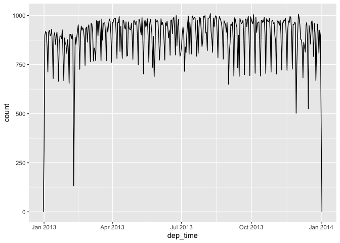
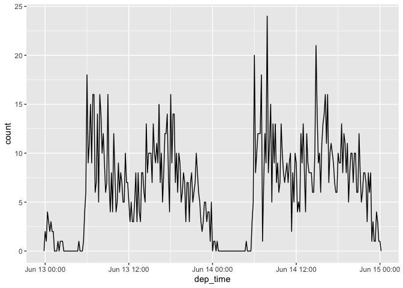
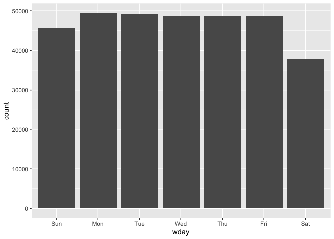
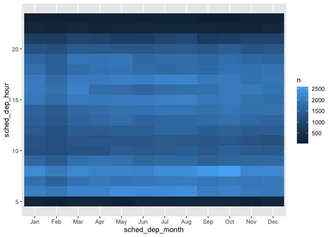
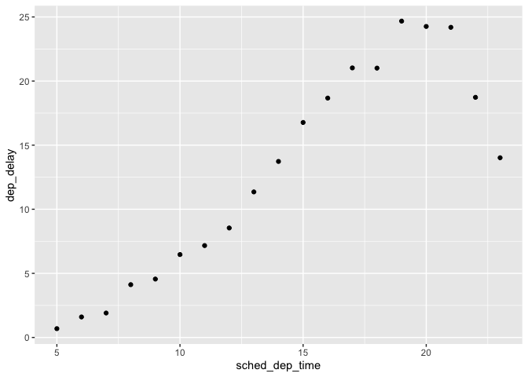
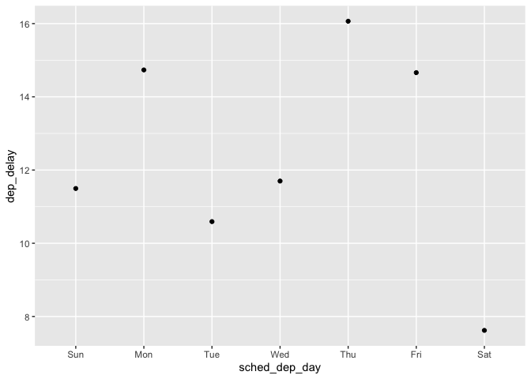
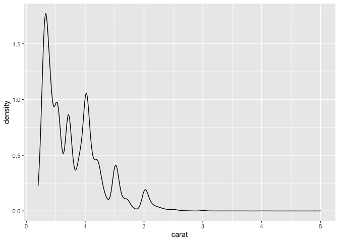
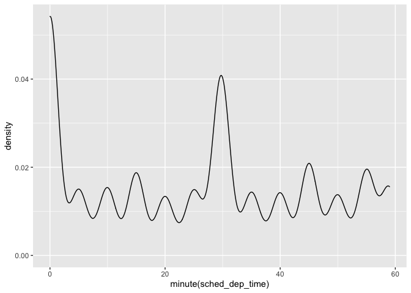
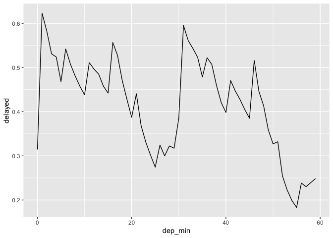

R4DS Wrangle Section: Dates Chapter
================
H. David Shea
22 January 2021

## 16.2 creating date/times

``` r
flights %>% 
    select(year, month, day, hour, minute) %>% 
    mutate(departure = make_datetime(year, month, day, hour, minute))
```

    ## # A tibble: 336,776 x 6
    ##     year month   day  hour minute departure          
    ##    <int> <int> <int> <dbl>  <dbl> <dttm>             
    ##  1  2013     1     1     5     15 2013-01-01 05:15:00
    ##  2  2013     1     1     5     29 2013-01-01 05:29:00
    ##  3  2013     1     1     5     40 2013-01-01 05:40:00
    ##  4  2013     1     1     5     45 2013-01-01 05:45:00
    ##  5  2013     1     1     6      0 2013-01-01 06:00:00
    ##  6  2013     1     1     5     58 2013-01-01 05:58:00
    ##  7  2013     1     1     6      0 2013-01-01 06:00:00
    ##  8  2013     1     1     6      0 2013-01-01 06:00:00
    ##  9  2013     1     1     6      0 2013-01-01 06:00:00
    ## 10  2013     1     1     6      0 2013-01-01 06:00:00
    ## # … with 336,766 more rows

``` r
make_datetime_100 <- function(year, month, day, time) {
    make_datetime(year, month, day, time %/% 100, time %% 100)
}

flights_dt <- flights %>% 
    filter(!is.na(dep_time), !is.na(arr_time)) %>% 
    mutate(
        dep_time = make_datetime_100(year, month, day, dep_time),
        arr_time = make_datetime_100(year, month, day, arr_time),
        sched_dep_time = make_datetime_100(year, month, day, sched_dep_time),
        sched_arr_time = make_datetime_100(year, month, day, sched_arr_time)
    ) %>% 
    select(origin, dest, ends_with("delay"), ends_with("time"))
```

``` r
flights_dt
```

    ## # A tibble: 328,063 x 9
    ##    origin dest  dep_delay arr_delay dep_time            sched_dep_time     
    ##    <chr>  <chr>     <dbl>     <dbl> <dttm>              <dttm>             
    ##  1 EWR    IAH           2        11 2013-01-01 05:17:00 2013-01-01 05:15:00
    ##  2 LGA    IAH           4        20 2013-01-01 05:33:00 2013-01-01 05:29:00
    ##  3 JFK    MIA           2        33 2013-01-01 05:42:00 2013-01-01 05:40:00
    ##  4 JFK    BQN          -1       -18 2013-01-01 05:44:00 2013-01-01 05:45:00
    ##  5 LGA    ATL          -6       -25 2013-01-01 05:54:00 2013-01-01 06:00:00
    ##  6 EWR    ORD          -4        12 2013-01-01 05:54:00 2013-01-01 05:58:00
    ##  7 EWR    FLL          -5        19 2013-01-01 05:55:00 2013-01-01 06:00:00
    ##  8 LGA    IAD          -3       -14 2013-01-01 05:57:00 2013-01-01 06:00:00
    ##  9 JFK    MCO          -3        -8 2013-01-01 05:57:00 2013-01-01 06:00:00
    ## 10 LGA    ORD          -2         8 2013-01-01 05:58:00 2013-01-01 06:00:00
    ## # … with 328,053 more rows, and 3 more variables: arr_time <dttm>,
    ## #   sched_arr_time <dttm>, air_time <dbl>

``` r
flights_dt %>% 
    ggplot(aes(dep_time)) + 
    geom_freqpoly(binwidth = 86400) # 86400 seconds = 1 day
```

<!-- -->

``` r
flights_dt %>% 
    filter(dep_time >= ymd(20130613), dep_time < ymd(20130615)) %>% 
    ggplot(aes(dep_time)) + 
    geom_freqpoly(binwidth = 600) # 600 s = 10 minutes
```

<!-- -->

### 16.2 Exercises

Use the appropriate lubridate function to parse each of the following
dates:

``` r
d1 <- "January 1, 2010"
d2 <- "2015-Mar-07"
d3 <- "06-Jun-2017"
d4 <- c("August 19 (2015)", "July 1 (2015)")
d5 <- "12/30/14" # Dec 30, 2014
```

``` r
mdy(d1)
```

    ## [1] "2010-01-01"

``` r
ymd(d2)
```

    ## [1] "2015-03-07"

``` r
dmy(d3)
```

    ## [1] "2017-06-06"

``` r
mdy(d4)
```

    ## [1] "2015-08-19" "2015-07-01"

``` r
mdy(d5)
```

    ## [1] "2014-12-30"

## 16.3 date/times components

``` r
flights_dt %>% 
    mutate(wday = wday(dep_time, label = TRUE)) %>% 
    ggplot(aes(x = wday)) +
    geom_bar()
```

<!-- -->

``` r
flights_dt %>% 
    select(dep_time) %>%
    mutate(dep_week = floor_date(dep_time, "week"))
```

    ## # A tibble: 328,063 x 2
    ##    dep_time            dep_week           
    ##    <dttm>              <dttm>             
    ##  1 2013-01-01 05:17:00 2012-12-30 00:00:00
    ##  2 2013-01-01 05:33:00 2012-12-30 00:00:00
    ##  3 2013-01-01 05:42:00 2012-12-30 00:00:00
    ##  4 2013-01-01 05:44:00 2012-12-30 00:00:00
    ##  5 2013-01-01 05:54:00 2012-12-30 00:00:00
    ##  6 2013-01-01 05:54:00 2012-12-30 00:00:00
    ##  7 2013-01-01 05:55:00 2012-12-30 00:00:00
    ##  8 2013-01-01 05:57:00 2012-12-30 00:00:00
    ##  9 2013-01-01 05:57:00 2012-12-30 00:00:00
    ## 10 2013-01-01 05:58:00 2012-12-30 00:00:00
    ## # … with 328,053 more rows

### 16.3 exercises

How does the distribution of flight times within a day change over the
course of the year?

``` r
flights_dt %>% 
    mutate(
        sched_dep_hour = hour(sched_dep_time),
        sched_dep_month= month(sched_dep_time, label = TRUE)) %>%
    group_by(sched_dep_month, sched_dep_hour) %>%
    count() %>%
    ggplot(mapping = aes(x = sched_dep_month, y = sched_dep_hour)) +
    geom_tile(mapping = aes(fill = n))
```

<!-- -->

Compare dep\_time, sched\_dep\_time and dep\_delay. Are they consistent?
Explain your findings.

``` r
flights_dt %>% 
    mutate(
        calc_delay = as.numeric(dep_time - sched_dep_time) / 60,
        delay_diff = calc_delay - dep_delay
        ) %>%
    select(dep_time, sched_dep_time, dep_delay, calc_delay, delay_diff) %>%
    filter(delay_diff > 0)
```

    ## # A tibble: 0 x 5
    ## # … with 5 variables: dep_time <dttm>, sched_dep_time <dttm>, dep_delay <dbl>,
    ## #   calc_delay <dbl>, delay_diff <dbl>

Compare air\_time with the duration between the departure and arrival.
Explain your findings. (Hint: consider the location of the airport.)

``` r
flights_dt %>% 
    mutate(
        arr_dep_diff = as.numeric(arr_time - dep_time),
        var_ = abs(air_time - arr_dep_diff)
        ) %>%
    select(-contains("sched")) %>%
    left_join(
        select(mutate(airports, tz_dst = tz), faa, tz_dst), 
        by = c("dest" = "faa")
    ) %>%
    left_join(
        select(mutate(airports, tz_arr = tz), faa, tz_arr), 
        by = c("origin" = "faa")
    ) %>%
    filter(tz_dst != tz_arr) %>%
    select(-contains("sched"), -contains("_delay"), -dep_time, -arr_time)
```

    ## # A tibble: 133,894 x 7
    ##    origin dest  air_time arr_dep_diff  var_ tz_dst tz_arr
    ##    <chr>  <chr>    <dbl>        <dbl> <dbl>  <dbl>  <dbl>
    ##  1 EWR    IAH        227          193    34     -6     -5
    ##  2 LGA    IAH        227          197    30     -6     -5
    ##  3 EWR    ORD        150          106    44     -6     -5
    ##  4 LGA    ORD        138          115    23     -6     -5
    ##  5 JFK    LAX        345          206   139     -8     -5
    ##  6 EWR    SFO        361          205   156     -8     -5
    ##  7 LGA    DFW        257          222    35     -6     -5
    ##  8 EWR    LAS        337          175   162     -8     -5
    ##  9 LGA    MSP        170          130    40     -6     -5
    ## 10 EWR    ORD        139          119    20     -6     -5
    ## # … with 133,884 more rows

large variations seem to be timezone differences between origin and dest
but there are still unexplained variations

How does the average delay time change over the course of a day? Should
you use dep\_time or sched\_dep\_time? Why?

``` r
flights_dt %>%
    mutate(sched_dep_time = hour(sched_dep_time)) %>% # lump into hours through day
    group_by(sched_dep_time) %>%
    summarise(dep_delay = mean(dep_delay)) %>%
    ggplot(aes(y = dep_delay, x = sched_dep_time)) +
    geom_point()
```

<!-- -->

On what day of the week should you leave if you want to minimise the
chance of a delay?

``` r
flights_dt %>%
    mutate(sched_dep_day = wday(sched_dep_time, label = TRUE)) %>%
    group_by(sched_dep_day) %>%
    summarise(dep_delay = mean(dep_delay)) %>%
    ggplot(aes(y = dep_delay, x = sched_dep_day)) +
    geom_point()
```

<!-- -->

Saturday

What makes the distribution of carat in diamond data and
sched\_dep\_time in flights data similar?

``` r
diamonds %>%
    ggplot(aes(carat)) +
    geom_density()
```

<!-- -->

``` r
flights_dt %>%
    ggplot(aes(minute(sched_dep_time))) +
    geom_density()
```

<!-- -->

groupings of high density at "regular’ intervals: 1/2 carat, 1 carat, on
half hour, on hour

Confirm my hypothesis that the early departures of flights in minutes
20-30 and 50-60 are caused by scheduled flights that leave early. Hint:
create a binary variable that tells you whether or not a flight was
delayed.

``` r
flights_dt %>%
    select( origin, dest, contains("dep_")) %>%
    mutate(
        delayed = dep_delay > 0,
        dep_min = minute(dep_time)
        ) %>%
    group_by(dep_min) %>%
    summarise(delayed = mean(delayed, na.rm = TRUE)) %>%
    ggplot(aes(dep_min, delayed)) +
    geom_line()
```

<!-- -->

troughs in number of delays from 20-30 and 50-60 confirmed \#\# 16.4
time spans

durations

``` r
ddays(1) == days(1)
```

    ## [1] TRUE

1 day period does equal 1 day duration

math calls for subtly on, for instance, leap years and time zone changes
(e.g., EST to EDT)

``` r
ymd("2016-01-01") + dyears(1)
```

    ## [1] "2016-12-31 06:00:00 UTC"

``` r
ymd("2016-01-01") + years(1)
```

    ## [1] "2017-01-01"

``` r
ymd_hms("2016-03-12 13:00:00", tz = "America/New_York") + ddays(1)
```

    ## [1] "2016-03-13 14:00:00 EDT"

``` r
ymd_hms("2016-03-12 13:00:00", tz = "America/New_York") + days(1)
```

    ## [1] "2016-03-13 13:00:00 EDT"

``` r
dyears(1) / ddays(365)
```

    ## [1] 1.000685

``` r
years(1) / days(1)
```

    ## [1] 365.25

6.4.5 Exercises

Create a vector of dates giving the first day of every month in 2015.

``` r
make_date(2105, 1:12, 1)
```

    ##  [1] "2105-01-01" "2105-02-01" "2105-03-01" "2105-04-01" "2105-05-01"
    ##  [6] "2105-06-01" "2105-07-01" "2105-08-01" "2105-09-01" "2105-10-01"
    ## [11] "2105-11-01" "2105-12-01"

Create a vector of dates giving the first day of every month in the
current year.

``` r
make_date(year(now()), 1:12, 1)
```

    ##  [1] "2021-01-01" "2021-02-01" "2021-03-01" "2021-04-01" "2021-05-01"
    ##  [6] "2021-06-01" "2021-07-01" "2021-08-01" "2021-09-01" "2021-10-01"
    ## [11] "2021-11-01" "2021-12-01"

Write a function that given your birthday (as a date), returns how old
you are in years.

``` r
age_from_bday <- function(bday) {
    round((today() - bday) / dyears(1), 1)
}
age_from_bday(make_date(1962,2,14))
```

    ## [1] 58.9
