R4DS Wrangle Section: Factors Chapter
================
H. David Shea
21 January 2021

``` r
library(tidyverse)
```

    ## ── Attaching packages ─────────────────────────────────────── tidyverse 1.3.0 ──

    ## ✓ ggplot2 3.3.3     ✓ purrr   0.3.4
    ## ✓ tibble  3.0.5     ✓ dplyr   1.0.3
    ## ✓ tidyr   1.1.2     ✓ stringr 1.4.0
    ## ✓ readr   1.4.0     ✓ forcats 0.5.0

    ## ── Conflicts ────────────────────────────────────────── tidyverse_conflicts() ──
    ## x dplyr::filter() masks stats::filter()
    ## x dplyr::lag()    masks stats::lag()

15.3.1 exercise

Explore the distribution of rincome (reported income). What makes the
default bar chart hard to understand? How could you improve the plot?

``` r
gss_cat %>% 
    count(rincome)
```

    ## # A tibble: 16 x 2
    ##    rincome            n
    ##  * <fct>          <int>
    ##  1 No answer        183
    ##  2 Don't know       267
    ##  3 Refused          975
    ##  4 $25000 or more  7363
    ##  5 $20000 - 24999  1283
    ##  6 $15000 - 19999  1048
    ##  7 $10000 - 14999  1168
    ##  8 $8000 to 9999    340
    ##  9 $7000 to 7999    188
    ## 10 $6000 to 6999    215
    ## 11 $5000 to 5999    227
    ## 12 $4000 to 4999    226
    ## 13 $3000 to 3999    276
    ## 14 $1000 to 2999    395
    ## 15 Lt $1000         286
    ## 16 Not applicable  7043

Explore the distribution of rincome (reported income). What makes the
default bar chart hard to understand? How could you improve the plot?

``` r
ggplot(gss_cat, aes(rincome)) +
    geom_bar() +
    coord_flip() +
    scale_x_discrete(drop = FALSE)
```

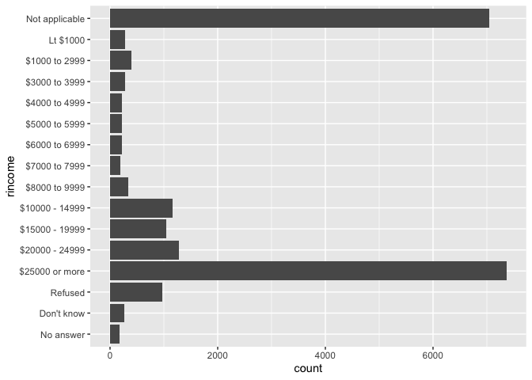<!-- -->

horizontal bars are easier to read

What is the most common relig in this survey?

``` r
gss_cat %>% 
    count(relig, sort = TRUE) %>%
    head(1)
```

    ## # A tibble: 1 x 2
    ##   relig          n
    ##   <fct>      <int>
    ## 1 Protestant 10846

Protestant 10846

What’s the most common partyid?

``` r
gss_cat %>% 
    count(partyid, sort = TRUE) %>%
    head(1)
```

    ## # A tibble: 1 x 2
    ##   partyid         n
    ##   <fct>       <int>
    ## 1 Independent  4119

Independent 4119

Which relig does denom (denomination) apply to? How can you find out
with a table? How can you find out with a visualization?

``` r
gss_cat %>% 
    count(relig, denom)
```

    ## # A tibble: 47 x 3
    ##    relig                   denom               n
    ##    <fct>                   <fct>           <int>
    ##  1 No answer               No answer          93
    ##  2 Don't know              Not applicable     15
    ##  3 Inter-nondenominational Not applicable    109
    ##  4 Native american         Not applicable     23
    ##  5 Christian               No answer           2
    ##  6 Christian               Don't know         11
    ##  7 Christian               No denomination   452
    ##  8 Christian               Not applicable    224
    ##  9 Orthodox-christian      Not applicable     95
    ## 10 Moslem/islam            Not applicable    104
    ## # … with 37 more rows

``` r
gss_cat %>% 
    count(relig, denom) %>%  
    ggplot(mapping = aes(x = relig, y = denom)) +
    geom_tile(mapping = aes(fill = n)) +
    theme(axis.text.x = element_text(angle = 45, hjust = 1))
```

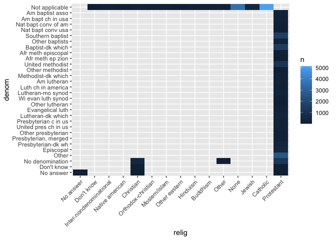<!-- -->

15.4 modifying factor order

factor reordering - general

``` r
relig_summary <- gss_cat %>%
    group_by(relig) %>%
    summarise(
        age = mean(age, na.rm = TRUE),
        tvhours = mean(tvhours, na.rm = TRUE),
        n = n()
    )
ggplot(relig_summary, aes(tvhours, relig)) + geom_point()
```

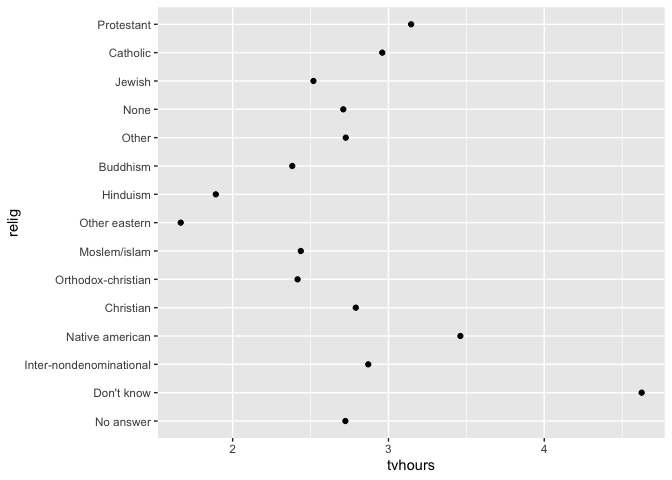<!-- -->

``` r
ggplot(relig_summary, aes(tvhours, fct_reorder(relig, tvhours))) +
    geom_point()
```

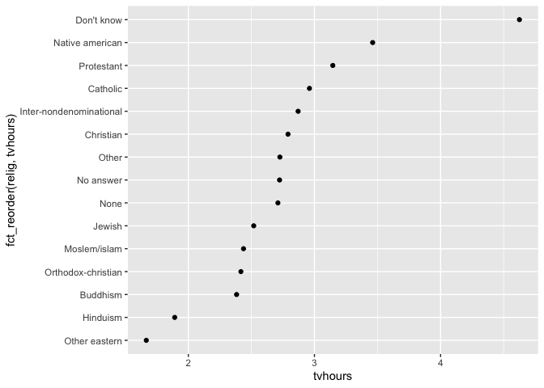<!-- -->

cases where factors have an implicit order shouldn’t be reordered, in
general

``` r
rincome_summary <- gss_cat %>%
    group_by(rincome) %>%
    summarise(
        age = mean(age, na.rm = TRUE),
        tvhours = mean(tvhours, na.rm = TRUE),
        n = n()
    )
ggplot(rincome_summary, aes(age, fct_reorder(rincome, age))) + geom_point()
```

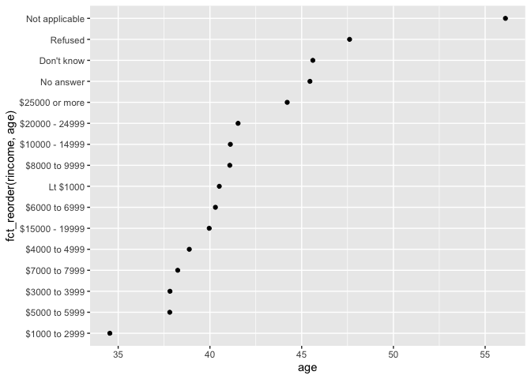<!-- -->

factor reordering - specific: fct\_relevel

``` r
ggplot(rincome_summary, aes(age, fct_relevel(rincome, "Not applicable"))) +
    geom_point()
```

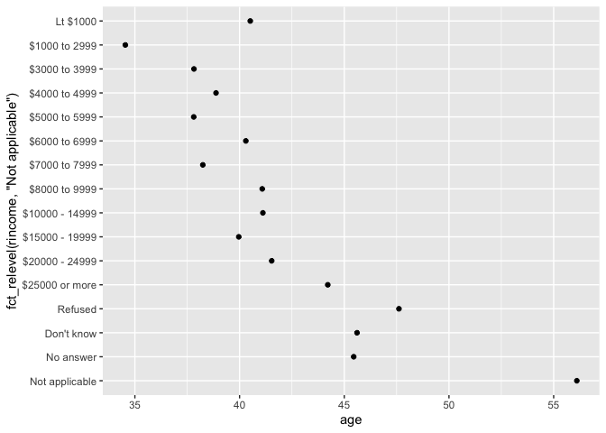<!-- -->

however, potentially benefited from specific case reordering

ordering factors by largest values of another values - fct\_reorder2

``` r
by_age <- gss_cat %>%
    filter(!is.na(age)) %>%
    count(age, marital) %>%
    group_by(age) %>%
    mutate(prop = n / sum(n))

ggplot(by_age, aes(age, prop, colour = marital)) +
    geom_line(na.rm = TRUE)
```

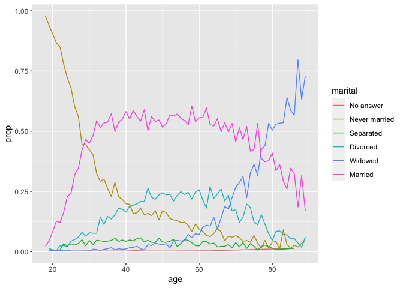<!-- -->

``` r
ggplot(by_age, aes(age, prop, colour = fct_reorder2(marital, age, prop))) +
    geom_line() +
    labs(colour = "marital")
```

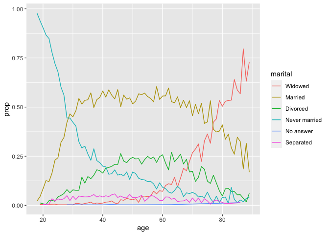<!-- -->

``` r
gss_cat %>%
    mutate(marital = marital %>% fct_infreq() %>% fct_rev()) %>%
    ggplot(aes(marital)) +
    geom_bar()
```

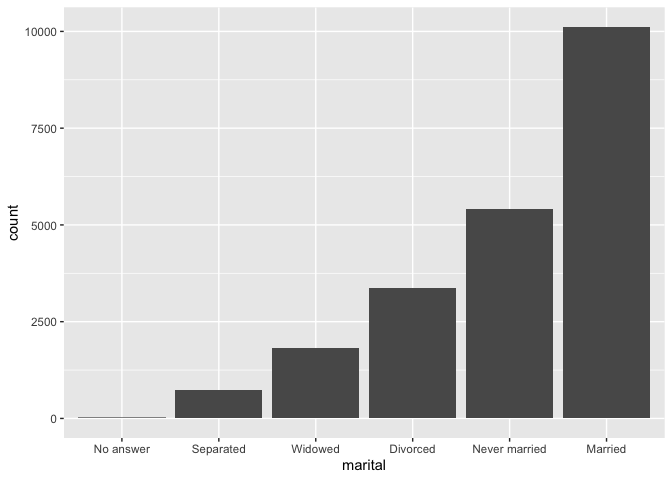<!-- -->

15.4.1 exercises

There are some suspiciously high numbers in tvhours. Is the mean a good
summary?

``` r
summary(gss_cat$tvhours)
```

    ##    Min. 1st Qu.  Median    Mean 3rd Qu.    Max.    NA's 
    ##   0.000   1.000   2.000   2.981   4.000  24.000   10146

mean is pretty close to median because the large outliers are few in
number but there are a large number of NAs as well

For each factor in gss\_cat identify whether the order of the levels is
arbitrary or principled.

``` r
levels(gss_cat$marital)
```

    ## [1] "No answer"     "Never married" "Separated"     "Divorced"     
    ## [5] "Widowed"       "Married"

somewhat - never separated from versions of married

``` r
levels(gss_cat$race)
```

    ## [1] "Other"          "Black"          "White"          "Not applicable"

no

``` r
levels(gss_cat$rincome)
```

    ##  [1] "No answer"      "Don't know"     "Refused"        "$25000 or more"
    ##  [5] "$20000 - 24999" "$15000 - 19999" "$10000 - 14999" "$8000 to 9999" 
    ##  [9] "$7000 to 7999"  "$6000 to 6999"  "$5000 to 5999"  "$4000 to 4999" 
    ## [13] "$3000 to 3999"  "$1000 to 2999"  "Lt $1000"       "Not applicable"

yes

``` r
levels(gss_cat$relig)
```

    ##  [1] "No answer"               "Don't know"             
    ##  [3] "Inter-nondenominational" "Native american"        
    ##  [5] "Christian"               "Orthodox-christian"     
    ##  [7] "Moslem/islam"            "Other eastern"          
    ##  [9] "Hinduism"                "Buddhism"               
    ## [11] "Other"                   "None"                   
    ## [13] "Jewish"                  "Catholic"               
    ## [15] "Protestant"              "Not applicable"

maybe some, but nothing consistent

``` r
levels(gss_cat$denom)
```

    ##  [1] "No answer"            "Don't know"           "No denomination"     
    ##  [4] "Other"                "Episcopal"            "Presbyterian-dk wh"  
    ##  [7] "Presbyterian, merged" "Other presbyterian"   "United pres ch in us"
    ## [10] "Presbyterian c in us" "Lutheran-dk which"    "Evangelical luth"    
    ## [13] "Other lutheran"       "Wi evan luth synod"   "Lutheran-mo synod"   
    ## [16] "Luth ch in america"   "Am lutheran"          "Methodist-dk which"  
    ## [19] "Other methodist"      "United methodist"     "Afr meth ep zion"    
    ## [22] "Afr meth episcopal"   "Baptist-dk which"     "Other baptists"      
    ## [25] "Southern baptist"     "Nat bapt conv usa"    "Nat bapt conv of am" 
    ## [28] "Am bapt ch in usa"    "Am baptist asso"      "Not applicable"

somewhat - some logical groups within protestant

Why did moving “Not applicable” to the front of the levels move it to
the bottom of the plot?

``` r
levels(gss_cat$rincome)
```

    ##  [1] "No answer"      "Don't know"     "Refused"        "$25000 or more"
    ##  [5] "$20000 - 24999" "$15000 - 19999" "$10000 - 14999" "$8000 to 9999" 
    ##  [9] "$7000 to 7999"  "$6000 to 6999"  "$5000 to 5999"  "$4000 to 4999" 
    ## [13] "$3000 to 3999"  "$1000 to 2999"  "Lt $1000"       "Not applicable"

``` r
levels(fct_relevel(gss_cat$rincome, "Not applicable"))
```

    ##  [1] "Not applicable" "No answer"      "Don't know"     "Refused"       
    ##  [5] "$25000 or more" "$20000 - 24999" "$15000 - 19999" "$10000 - 14999"
    ##  [9] "$8000 to 9999"  "$7000 to 7999"  "$6000 to 6999"  "$5000 to 5999" 
    ## [13] "$4000 to 4999"  "$3000 to 3999"  "$1000 to 2999"  "Lt $1000"

as all unlisted levels stay the same, “Not app” became the first.
Default boxplot puts highest ordinal numbered factors from top down

15.5 modifying factor levels

partyid has some continuity in factor (e.g., right to middle to left)

``` r
levels(gss_cat$partyid)
```

    ##  [1] "No answer"          "Don't know"         "Other party"       
    ##  [4] "Strong republican"  "Not str republican" "Ind,near rep"      
    ##  [7] "Independent"        "Ind,near dem"       "Not str democrat"  
    ## [10] "Strong democrat"

Category descriptions coud be better - consistent and more descriptive

``` r
gss_cat %>%
    mutate(partyid = fct_recode(partyid,
                                "Republican, strong"    = "Strong republican",
                                "Republican, weak"      = "Not str republican",
                                "Independent, near rep" = "Ind,near rep",
                                "Independent, near dem" = "Ind,near dem",
                                "Democrat, weak"        = "Not str democrat",
                                "Democrat, strong"      = "Strong democrat"
    )) %>%
    count(partyid)
```

    ## # A tibble: 10 x 2
    ##    partyid                   n
    ##  * <fct>                 <int>
    ##  1 No answer               154
    ##  2 Don't know                1
    ##  3 Other party             393
    ##  4 Republican, strong     2314
    ##  5 Republican, weak       3032
    ##  6 Independent, near rep  1791
    ##  7 Independent            4119
    ##  8 Independent, near dem  2499
    ##  9 Democrat, weak         3690
    ## 10 Democrat, strong       3490

and put all non specific answers in one group: other

``` r
gss_cat %>%
    mutate(partyid = fct_recode(partyid,
                                "Republican, strong"    = "Strong republican",
                                "Republican, weak"      = "Not str republican",
                                "Independent, near rep" = "Ind,near rep",
                                "Independent, near dem" = "Ind,near dem",
                                "Democrat, weak"        = "Not str democrat",
                                "Democrat, strong"      = "Strong democrat",
                                "Other"                 = "No answer",
                                "Other"                 = "Don't know",
                                "Other"                 = "Other party"
    )) %>%
    ggplot(aes(partyid)) +
    geom_bar() +
    coord_flip()
```

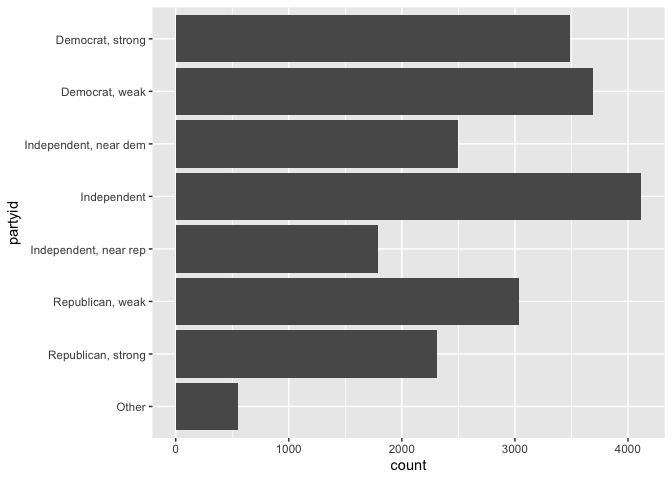<!-- -->

lumping groups together: fct\_lump

``` r
r1 <- gss_cat %>%
    count(relig, sort = TRUE) %>%
    transmute(relig, n_pre_lump = n)

r2 <- gss_cat %>%
    mutate(relig = fct_lump(relig, n = 10)) %>%
    count(relig, sort = TRUE) %>%
    transmute(relig, n_post_lump = n)

r1 %>% left_join(r2, by = "relig")
```

    ## # A tibble: 15 x 3
    ##    relig                   n_pre_lump n_post_lump
    ##    <fct>                        <int>       <int>
    ##  1 Protestant                   10846       10846
    ##  2 Catholic                      5124        5124
    ##  3 None                          3523        3523
    ##  4 Christian                      689         689
    ##  5 Jewish                         388         388
    ##  6 Other                          224         458
    ##  7 Buddhism                       147         147
    ##  8 Inter-nondenominational        109         109
    ##  9 Moslem/islam                   104         104
    ## 10 Orthodox-christian              95          95
    ## 11 No answer                       93          NA
    ## 12 Hinduism                        71          NA
    ## 13 Other eastern                   32          NA
    ## 14 Native american                 23          NA
    ## 15 Don't know                      15          NA

15.5.1 exercises

How have the proportions of people identifying as Democrat, Republican,
and Independent changed over time?

``` r
gss_cat %>%
    mutate(
        partyid = 
            fct_collapse(partyid,
                         Other = c("No answer", "Don't know", "Other party"),
                         Republican = c("Strong republican", "Not str republican"),
                         Independent = c("Ind,near rep", "Independent", "Ind,near dem"),
                         Democrat = c("Not str democrat", "Strong democrat")
            )
    ) %>%
    count(year, partyid) %>%
    group_by(year) %>%
    mutate(pct = 100 * n / sum(n)) %>%
    ggplot(aes(x = year, y = pct, color = fct_reorder2(partyid, year, pct))) +
    geom_line() +
    labs(color = "Political Party", x = "Year", y = "% of Population")
```

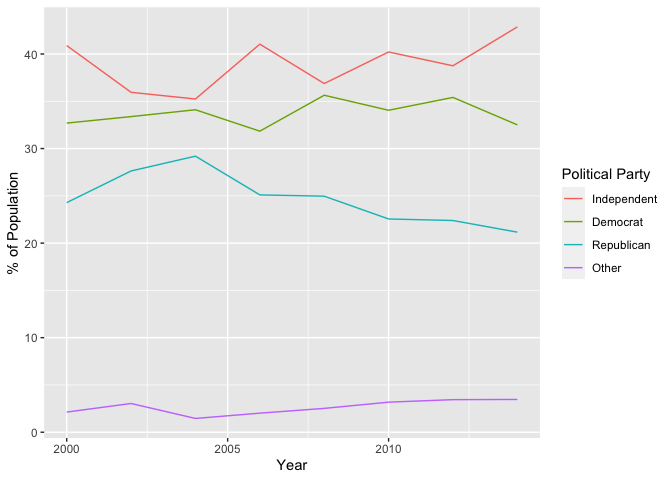<!-- -->

How could you collapse rincome into a small set of categories?

``` r
gss_cat %>%
    mutate(
        rincome = 
            fct_collapse(rincome,
                         "Other" = c("No answer", "Don't know", "Refused", "Not applicable"),
                         "Less Than $5000" = c("Lt $1000", "$1000 to 2999", "$3000 to 3999", "$4000 to 4999"),
                         "$5000 - $9999"   = c("$5000 to 5999", "$6000 to 6999", "$7000 to 7999", "$8000 to 9999")
            )
    ) %>%
    ggplot( aes(rincome)) +
    geom_bar() +
    coord_flip() +
    scale_x_discrete(drop = FALSE)
```

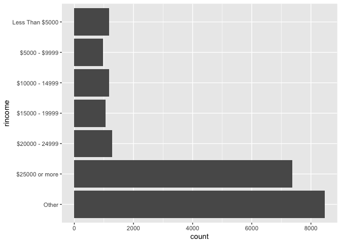<!-- -->
