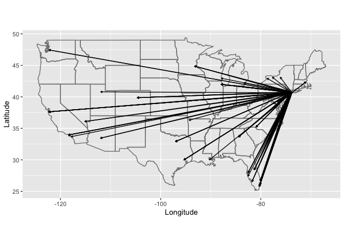

R4DS Wrangle Section: Relational Data Chapter
================
H. David Shea
18 January 2021

``` r
library(tidyverse)
```

    ## ── Attaching packages ─────────────────────────────────────── tidyverse 1.3.0 ──

    ## ✓ ggplot2 3.3.3     ✓ purrr   0.3.4
    ## ✓ tibble  3.0.5     ✓ dplyr   1.0.3
    ## ✓ tidyr   1.1.2     ✓ stringr 1.4.0
    ## ✓ readr   1.4.0     ✓ forcats 0.5.0

    ## ── Conflicts ────────────────────────────────────────── tidyverse_conflicts() ──
    ## x dplyr::filter() masks stats::filter()
    ## x dplyr::lag()    masks stats::lag()

``` r
library(nycflights13)
```

example tables

``` r
flights
```

    ## # A tibble: 336,776 x 19
    ##     year month   day dep_time sched_dep_time dep_delay arr_time sched_arr_time
    ##    <int> <int> <int>    <int>          <int>     <dbl>    <int>          <int>
    ##  1  2013     1     1      517            515         2      830            819
    ##  2  2013     1     1      533            529         4      850            830
    ##  3  2013     1     1      542            540         2      923            850
    ##  4  2013     1     1      544            545        -1     1004           1022
    ##  5  2013     1     1      554            600        -6      812            837
    ##  6  2013     1     1      554            558        -4      740            728
    ##  7  2013     1     1      555            600        -5      913            854
    ##  8  2013     1     1      557            600        -3      709            723
    ##  9  2013     1     1      557            600        -3      838            846
    ## 10  2013     1     1      558            600        -2      753            745
    ## # … with 336,766 more rows, and 11 more variables: arr_delay <dbl>,
    ## #   carrier <chr>, flight <int>, tailnum <chr>, origin <chr>, dest <chr>,
    ## #   air_time <dbl>, distance <dbl>, hour <dbl>, minute <dbl>, time_hour <dttm>

``` r
airlines
```

    ## # A tibble: 16 x 2
    ##    carrier name                       
    ##    <chr>   <chr>                      
    ##  1 9E      Endeavor Air Inc.          
    ##  2 AA      American Airlines Inc.     
    ##  3 AS      Alaska Airlines Inc.       
    ##  4 B6      JetBlue Airways            
    ##  5 DL      Delta Air Lines Inc.       
    ##  6 EV      ExpressJet Airlines Inc.   
    ##  7 F9      Frontier Airlines Inc.     
    ##  8 FL      AirTran Airways Corporation
    ##  9 HA      Hawaiian Airlines Inc.     
    ## 10 MQ      Envoy Air                  
    ## 11 OO      SkyWest Airlines Inc.      
    ## 12 UA      United Air Lines Inc.      
    ## 13 US      US Airways Inc.            
    ## 14 VX      Virgin America             
    ## 15 WN      Southwest Airlines Co.     
    ## 16 YV      Mesa Airlines Inc.

``` r
airports
```

    ## # A tibble: 1,458 x 8
    ##    faa   name                       lat    lon   alt    tz dst   tzone          
    ##    <chr> <chr>                    <dbl>  <dbl> <dbl> <dbl> <chr> <chr>          
    ##  1 04G   Lansdowne Airport         41.1  -80.6  1044    -5 A     America/New_Yo…
    ##  2 06A   Moton Field Municipal A…  32.5  -85.7   264    -6 A     America/Chicago
    ##  3 06C   Schaumburg Regional       42.0  -88.1   801    -6 A     America/Chicago
    ##  4 06N   Randall Airport           41.4  -74.4   523    -5 A     America/New_Yo…
    ##  5 09J   Jekyll Island Airport     31.1  -81.4    11    -5 A     America/New_Yo…
    ##  6 0A9   Elizabethton Municipal …  36.4  -82.2  1593    -5 A     America/New_Yo…
    ##  7 0G6   Williams County Airport   41.5  -84.5   730    -5 A     America/New_Yo…
    ##  8 0G7   Finger Lakes Regional A…  42.9  -76.8   492    -5 A     America/New_Yo…
    ##  9 0P2   Shoestring Aviation Air…  39.8  -76.6  1000    -5 U     America/New_Yo…
    ## 10 0S9   Jefferson County Intl     48.1 -123.    108    -8 A     America/Los_An…
    ## # … with 1,448 more rows

``` r
planes
```

    ## # A tibble: 3,322 x 9
    ##    tailnum  year type          manufacturer   model  engines seats speed engine 
    ##    <chr>   <int> <chr>         <chr>          <chr>    <int> <int> <int> <chr>  
    ##  1 N10156   2004 Fixed wing m… EMBRAER        EMB-1…       2    55    NA Turbo-…
    ##  2 N102UW   1998 Fixed wing m… AIRBUS INDUST… A320-…       2   182    NA Turbo-…
    ##  3 N103US   1999 Fixed wing m… AIRBUS INDUST… A320-…       2   182    NA Turbo-…
    ##  4 N104UW   1999 Fixed wing m… AIRBUS INDUST… A320-…       2   182    NA Turbo-…
    ##  5 N10575   2002 Fixed wing m… EMBRAER        EMB-1…       2    55    NA Turbo-…
    ##  6 N105UW   1999 Fixed wing m… AIRBUS INDUST… A320-…       2   182    NA Turbo-…
    ##  7 N107US   1999 Fixed wing m… AIRBUS INDUST… A320-…       2   182    NA Turbo-…
    ##  8 N108UW   1999 Fixed wing m… AIRBUS INDUST… A320-…       2   182    NA Turbo-…
    ##  9 N109UW   1999 Fixed wing m… AIRBUS INDUST… A320-…       2   182    NA Turbo-…
    ## 10 N110UW   1999 Fixed wing m… AIRBUS INDUST… A320-…       2   182    NA Turbo-…
    ## # … with 3,312 more rows

``` r
weather
```

    ## # A tibble: 26,115 x 15
    ##    origin  year month   day  hour  temp  dewp humid wind_dir wind_speed
    ##    <chr>  <int> <int> <int> <int> <dbl> <dbl> <dbl>    <dbl>      <dbl>
    ##  1 EWR     2013     1     1     1  39.0  26.1  59.4      270      10.4 
    ##  2 EWR     2013     1     1     2  39.0  27.0  61.6      250       8.06
    ##  3 EWR     2013     1     1     3  39.0  28.0  64.4      240      11.5 
    ##  4 EWR     2013     1     1     4  39.9  28.0  62.2      250      12.7 
    ##  5 EWR     2013     1     1     5  39.0  28.0  64.4      260      12.7 
    ##  6 EWR     2013     1     1     6  37.9  28.0  67.2      240      11.5 
    ##  7 EWR     2013     1     1     7  39.0  28.0  64.4      240      15.0 
    ##  8 EWR     2013     1     1     8  39.9  28.0  62.2      250      10.4 
    ##  9 EWR     2013     1     1     9  39.9  28.0  62.2      260      15.0 
    ## 10 EWR     2013     1     1    10  41    28.0  59.6      260      13.8 
    ## # … with 26,105 more rows, and 5 more variables: wind_gust <dbl>, precip <dbl>,
    ## #   pressure <dbl>, visib <dbl>, time_hour <dttm>

exercises 13.2 Imagine you wanted to draw (approximately) the route each
plane flies from its origin to its destination. What variables would you
need? What tables would you need to combine?

``` r
select(
    flights %>%
        filter(!is.na(arr_time)) %>% # flights that actually arrived at the destination
        inner_join(
            select(airports, origin = faa, origin_lat = lat, origin_lon = lon),
            by = "origin"
        ) %>%
        inner_join(
            select(airports, dest = faa, dest_lat = lat, dest_lon = lon),
            by = "dest"
        ),
    year, month, day, carrier, flight,
    origin, origin_lat, origin_lon,
    dest, dest_lat, dest_lon
)
```

    ## # A tibble: 320,503 x 11
    ##     year month   day carrier flight origin origin_lat origin_lon dest  dest_lat
    ##    <int> <int> <int> <chr>    <int> <chr>       <dbl>      <dbl> <chr>    <dbl>
    ##  1  2013     1     1 UA        1545 EWR          40.7      -74.2 IAH       30.0
    ##  2  2013     1     1 UA        1714 LGA          40.8      -73.9 IAH       30.0
    ##  3  2013     1     1 AA        1141 JFK          40.6      -73.8 MIA       25.8
    ##  4  2013     1     1 DL         461 LGA          40.8      -73.9 ATL       33.6
    ##  5  2013     1     1 UA        1696 EWR          40.7      -74.2 ORD       42.0
    ##  6  2013     1     1 B6         507 EWR          40.7      -74.2 FLL       26.1
    ##  7  2013     1     1 EV        5708 LGA          40.8      -73.9 IAD       38.9
    ##  8  2013     1     1 B6          79 JFK          40.6      -73.8 MCO       28.4
    ##  9  2013     1     1 AA         301 LGA          40.8      -73.9 ORD       42.0
    ## 10  2013     1     1 B6          49 JFK          40.6      -73.8 PBI       26.7
    ## # … with 320,493 more rows, and 1 more variable: dest_lon <dbl>

Very cute graphics added to this answer adapted from jrnold.github.io

``` r
flights_latlon <-
    select(
        flights %>%
            filter(!is.na(arr_time)) %>% # flights that actually arrived at the destination
            inner_join(
                select(airports, origin = faa, origin_lat = lat, origin_lon = lon),
                by = "origin"
            ) %>%
            inner_join(
                select(airports, dest = faa, dest_lat = lat, dest_lon = lon),
                by = "dest"
            ),
        year, month, day, carrier, flight,
        origin, origin_lat, origin_lon,
        dest, dest_lat, dest_lon
    )
    
flights_latlon %>%
    slice(1:100) %>%
    ggplot(aes(
        x = origin_lon, xend = dest_lon,
        y = origin_lat, yend = dest_lat
    )) +
    borders("state") +
    geom_segment(arrow = arrow(length = unit(0.1, "cm"))) +
    coord_quickmap() +
    labs(y = "Latitude", x = "Longitude")
```

<!-- -->

primary keys testing uniqueness of primary keys

``` r
planes %>% 
    count(tailnum) %>% 
    filter(n > 1)
```

    ## # A tibble: 0 x 2
    ## # … with 2 variables: tailnum <chr>, n <int>

``` r
weather %>% 
    count(year, month, day, hour, origin) %>% 
    filter(n > 1)
```

    ## # A tibble: 3 x 6
    ##    year month   day  hour origin     n
    ##   <int> <int> <int> <int> <chr>  <int>
    ## 1  2013    11     3     1 EWR        2
    ## 2  2013    11     3     1 JFK        2
    ## 3  2013    11     3     1 LGA        2

There maybe erroneous entries in the weather table for 3 Nov 2013 at
1:00AM
