R4DS Wrangle Section: Relational Data Chapter
================
H. David Shea
18 January 2021

``` r
library(tidyverse)
```

    ## ── Attaching packages ─────────────────────────────────────── tidyverse 1.3.0 ──

    ## ✓ ggplot2 3.3.3     ✓ purrr   0.3.4
    ## ✓ tibble  3.0.5     ✓ dplyr   1.0.3
    ## ✓ tidyr   1.1.2     ✓ stringr 1.4.0
    ## ✓ readr   1.4.0     ✓ forcats 0.5.0

    ## ── Conflicts ────────────────────────────────────────── tidyverse_conflicts() ──
    ## x dplyr::filter() masks stats::filter()
    ## x dplyr::lag()    masks stats::lag()

``` r
library(nycflights13)
library(Lahman)
library(nasaweather)
```

    ## 
    ## Attaching package: 'nasaweather'

    ## The following object is masked from 'package:dplyr':
    ## 
    ##     storms

example tables

``` r
flights
```

    ## # A tibble: 336,776 x 19
    ##     year month   day dep_time sched_dep_time dep_delay arr_time sched_arr_time
    ##    <int> <int> <int>    <int>          <int>     <dbl>    <int>          <int>
    ##  1  2013     1     1      517            515         2      830            819
    ##  2  2013     1     1      533            529         4      850            830
    ##  3  2013     1     1      542            540         2      923            850
    ##  4  2013     1     1      544            545        -1     1004           1022
    ##  5  2013     1     1      554            600        -6      812            837
    ##  6  2013     1     1      554            558        -4      740            728
    ##  7  2013     1     1      555            600        -5      913            854
    ##  8  2013     1     1      557            600        -3      709            723
    ##  9  2013     1     1      557            600        -3      838            846
    ## 10  2013     1     1      558            600        -2      753            745
    ## # … with 336,766 more rows, and 11 more variables: arr_delay <dbl>,
    ## #   carrier <chr>, flight <int>, tailnum <chr>, origin <chr>, dest <chr>,
    ## #   air_time <dbl>, distance <dbl>, hour <dbl>, minute <dbl>, time_hour <dttm>

``` r
airlines
```

    ## # A tibble: 16 x 2
    ##    carrier name                       
    ##    <chr>   <chr>                      
    ##  1 9E      Endeavor Air Inc.          
    ##  2 AA      American Airlines Inc.     
    ##  3 AS      Alaska Airlines Inc.       
    ##  4 B6      JetBlue Airways            
    ##  5 DL      Delta Air Lines Inc.       
    ##  6 EV      ExpressJet Airlines Inc.   
    ##  7 F9      Frontier Airlines Inc.     
    ##  8 FL      AirTran Airways Corporation
    ##  9 HA      Hawaiian Airlines Inc.     
    ## 10 MQ      Envoy Air                  
    ## 11 OO      SkyWest Airlines Inc.      
    ## 12 UA      United Air Lines Inc.      
    ## 13 US      US Airways Inc.            
    ## 14 VX      Virgin America             
    ## 15 WN      Southwest Airlines Co.     
    ## 16 YV      Mesa Airlines Inc.

``` r
airports
```

    ## # A tibble: 1,458 x 8
    ##    faa   name                       lat    lon   alt    tz dst   tzone          
    ##    <chr> <chr>                    <dbl>  <dbl> <dbl> <dbl> <chr> <chr>          
    ##  1 04G   Lansdowne Airport         41.1  -80.6  1044    -5 A     America/New_Yo…
    ##  2 06A   Moton Field Municipal A…  32.5  -85.7   264    -6 A     America/Chicago
    ##  3 06C   Schaumburg Regional       42.0  -88.1   801    -6 A     America/Chicago
    ##  4 06N   Randall Airport           41.4  -74.4   523    -5 A     America/New_Yo…
    ##  5 09J   Jekyll Island Airport     31.1  -81.4    11    -5 A     America/New_Yo…
    ##  6 0A9   Elizabethton Municipal …  36.4  -82.2  1593    -5 A     America/New_Yo…
    ##  7 0G6   Williams County Airport   41.5  -84.5   730    -5 A     America/New_Yo…
    ##  8 0G7   Finger Lakes Regional A…  42.9  -76.8   492    -5 A     America/New_Yo…
    ##  9 0P2   Shoestring Aviation Air…  39.8  -76.6  1000    -5 U     America/New_Yo…
    ## 10 0S9   Jefferson County Intl     48.1 -123.    108    -8 A     America/Los_An…
    ## # … with 1,448 more rows

``` r
planes
```

    ## # A tibble: 3,322 x 9
    ##    tailnum  year type          manufacturer   model  engines seats speed engine 
    ##    <chr>   <int> <chr>         <chr>          <chr>    <int> <int> <int> <chr>  
    ##  1 N10156   2004 Fixed wing m… EMBRAER        EMB-1…       2    55    NA Turbo-…
    ##  2 N102UW   1998 Fixed wing m… AIRBUS INDUST… A320-…       2   182    NA Turbo-…
    ##  3 N103US   1999 Fixed wing m… AIRBUS INDUST… A320-…       2   182    NA Turbo-…
    ##  4 N104UW   1999 Fixed wing m… AIRBUS INDUST… A320-…       2   182    NA Turbo-…
    ##  5 N10575   2002 Fixed wing m… EMBRAER        EMB-1…       2    55    NA Turbo-…
    ##  6 N105UW   1999 Fixed wing m… AIRBUS INDUST… A320-…       2   182    NA Turbo-…
    ##  7 N107US   1999 Fixed wing m… AIRBUS INDUST… A320-…       2   182    NA Turbo-…
    ##  8 N108UW   1999 Fixed wing m… AIRBUS INDUST… A320-…       2   182    NA Turbo-…
    ##  9 N109UW   1999 Fixed wing m… AIRBUS INDUST… A320-…       2   182    NA Turbo-…
    ## 10 N110UW   1999 Fixed wing m… AIRBUS INDUST… A320-…       2   182    NA Turbo-…
    ## # … with 3,312 more rows

``` r
weather
```

    ## # A tibble: 26,115 x 15
    ##    origin  year month   day  hour  temp  dewp humid wind_dir wind_speed
    ##    <chr>  <int> <int> <int> <int> <dbl> <dbl> <dbl>    <dbl>      <dbl>
    ##  1 EWR     2013     1     1     1  39.0  26.1  59.4      270      10.4 
    ##  2 EWR     2013     1     1     2  39.0  27.0  61.6      250       8.06
    ##  3 EWR     2013     1     1     3  39.0  28.0  64.4      240      11.5 
    ##  4 EWR     2013     1     1     4  39.9  28.0  62.2      250      12.7 
    ##  5 EWR     2013     1     1     5  39.0  28.0  64.4      260      12.7 
    ##  6 EWR     2013     1     1     6  37.9  28.0  67.2      240      11.5 
    ##  7 EWR     2013     1     1     7  39.0  28.0  64.4      240      15.0 
    ##  8 EWR     2013     1     1     8  39.9  28.0  62.2      250      10.4 
    ##  9 EWR     2013     1     1     9  39.9  28.0  62.2      260      15.0 
    ## 10 EWR     2013     1     1    10  41    28.0  59.6      260      13.8 
    ## # … with 26,105 more rows, and 5 more variables: wind_gust <dbl>, precip <dbl>,
    ## #   pressure <dbl>, visib <dbl>, time_hour <dttm>

exercises 13.2

Imagine you wanted to draw (approximately) the route each plane flies
from its origin to its destination. What variables would you need? What
tables would you need to combine?

``` r
select(
    flights %>%
        filter(!is.na(arr_time)) %>% # flights that actually arrived at the destination
        inner_join(
            select(airports, origin = faa, origin_lat = lat, origin_lon = lon),
            by = "origin"
        ) %>%
        inner_join(
            select(airports, dest = faa, dest_lat = lat, dest_lon = lon),
            by = "dest"
        ),
    year, month, day, carrier, flight,
    origin, origin_lat, origin_lon,
    dest, dest_lat, dest_lon
)
```

    ## # A tibble: 320,503 x 11
    ##     year month   day carrier flight origin origin_lat origin_lon dest  dest_lat
    ##    <int> <int> <int> <chr>    <int> <chr>       <dbl>      <dbl> <chr>    <dbl>
    ##  1  2013     1     1 UA        1545 EWR          40.7      -74.2 IAH       30.0
    ##  2  2013     1     1 UA        1714 LGA          40.8      -73.9 IAH       30.0
    ##  3  2013     1     1 AA        1141 JFK          40.6      -73.8 MIA       25.8
    ##  4  2013     1     1 DL         461 LGA          40.8      -73.9 ATL       33.6
    ##  5  2013     1     1 UA        1696 EWR          40.7      -74.2 ORD       42.0
    ##  6  2013     1     1 B6         507 EWR          40.7      -74.2 FLL       26.1
    ##  7  2013     1     1 EV        5708 LGA          40.8      -73.9 IAD       38.9
    ##  8  2013     1     1 B6          79 JFK          40.6      -73.8 MCO       28.4
    ##  9  2013     1     1 AA         301 LGA          40.8      -73.9 ORD       42.0
    ## 10  2013     1     1 B6          49 JFK          40.6      -73.8 PBI       26.7
    ## # … with 320,493 more rows, and 1 more variable: dest_lon <dbl>

Very cute graphics added to this answer adapted from jrnold.github.io

``` r
flights_latlon <-
    select(
        flights %>%
            filter(!is.na(arr_time)) %>% # flights that actually arrived at the destination
            inner_join(
                select(airports, origin = faa, origin_lat = lat, origin_lon = lon),
                by = "origin"
            ) %>%
            inner_join(
                select(airports, dest = faa, dest_lat = lat, dest_lon = lon),
                by = "dest"
            ),
        year, month, day, carrier, flight,
        origin, origin_lat, origin_lon,
        dest, dest_lat, dest_lon
    )
    
flights_latlon %>%
    slice(1:100) %>%
    ggplot(aes(
        x = origin_lon, xend = dest_lon,
        y = origin_lat, yend = dest_lat
    )) +
    borders("state") +
    geom_segment(arrow = arrow(length = unit(0.1, "cm"))) +
    coord_quickmap() +
    labs(y = "Latitude", x = "Longitude")
```

<!-- -->

primary keys

testing uniqueness of primary keys

``` r
planes %>% 
    count(tailnum) %>% 
    filter(n > 1)
```

    ## # A tibble: 0 x 2
    ## # … with 2 variables: tailnum <chr>, n <int>

``` r
weather %>% 
    count(year, month, day, hour, origin) %>% 
    filter(n > 1)
```

    ## # A tibble: 3 x 6
    ##    year month   day  hour origin     n
    ##   <int> <int> <int> <int> <chr>  <int>
    ## 1  2013    11     3     1 EWR        2
    ## 2  2013    11     3     1 JFK        2
    ## 3  2013    11     3     1 LGA        2

There maybe erroneous entries in the weather table for 3 Nov 2013 at
1:00AM

``` r
flights %>% 
    count(year, month, day, carrier, flight) %>% 
    filter(n > 1)
```

    ## # A tibble: 24 x 6
    ##     year month   day carrier flight     n
    ##    <int> <int> <int> <chr>    <int> <int>
    ##  1  2013     6     8 WN        2269     2
    ##  2  2013     6    15 WN        2269     2
    ##  3  2013     6    22 WN        2269     2
    ##  4  2013     6    29 WN        2269     2
    ##  5  2013     7     6 WN        2269     2
    ##  6  2013     7    13 WN        2269     2
    ##  7  2013     7    20 WN        2269     2
    ##  8  2013     7    27 WN        2269     2
    ##  9  2013     8     3 WN        2269     2
    ## 10  2013     8    10 WN        2269     2
    ## # … with 14 more rows

Looks like Southwest and United may have reused flight numbers on some
days - or some data problem

``` r
flights %>% 
    count(year, month, day, tailnum) %>% 
    filter(n > 1)
```

    ## # A tibble: 64,928 x 5
    ##     year month   day tailnum     n
    ##    <int> <int> <int> <chr>   <int>
    ##  1  2013     1     1 N0EGMQ      2
    ##  2  2013     1     1 N11189      2
    ##  3  2013     1     1 N11536      2
    ##  4  2013     1     1 N11544      3
    ##  5  2013     1     1 N11551      2
    ##  6  2013     1     1 N12540      2
    ##  7  2013     1     1 N12567      2
    ##  8  2013     1     1 N13123      2
    ##  9  2013     1     1 N13538      3
    ## 10  2013     1     1 N13566      3
    ## # … with 64,918 more rows

tailnum doesn’t work in primary key as planes could fly circuits through
the day

exercises 13.2

Add a surrogate key to flights.

``` r
flights_keyed <- flights %>%
    arrange(year, month, day, carrier, flight, sched_dep_time) %>%
    group_by(year, month, day, carrier, flight) %>%
    mutate(day_uid = row_number())

flights_keyed
```

    ## # A tibble: 336,776 x 20
    ## # Groups:   year, month, day, carrier, flight [336,752]
    ##     year month   day dep_time sched_dep_time dep_delay arr_time sched_arr_time
    ##    <int> <int> <int>    <int>          <int>     <dbl>    <int>          <int>
    ##  1  2013     1     1     1825           1829        -4     2056           2053
    ##  2  2013     1     1     1452           1455        -3     1637           1639
    ##  3  2013     1     1     2015           2005        10     2149           2144
    ##  4  2013     1     1     1637           1545        52     1858           1819
    ##  5  2013     1     1     1939           1840        59       29           2151
    ##  6  2013     1     1     1554           1600        -6     1701           1734
    ##  7  2013     1     1     1546           1540         6     1753           1748
    ##  8  2013     1     1     2115           1700       255     2330           1920
    ##  9  2013     1     1     2023           1945        38     2240           2206
    ## 10  2013     1     1     2046           2035        11     2144           2213
    ## # … with 336,766 more rows, and 12 more variables: arr_delay <dbl>,
    ## #   carrier <chr>, flight <int>, tailnum <chr>, origin <chr>, dest <chr>,
    ## #   air_time <dbl>, distance <dbl>, hour <dbl>, minute <dbl>, time_hour <dttm>,
    ## #   day_uid <int>

``` r
flights_keyed %>%
    count(year, month, day, carrier, flight, day_uid) %>% 
    filter(n > 1)
```

    ## # A tibble: 0 x 7
    ## # Groups:   year, month, day, carrier, flight [0]
    ## # … with 7 variables: year <int>, month <int>, day <int>, carrier <chr>,
    ## #   flight <int>, day_uid <int>, n <int>

exercises 13.3

AddIdentify the keys in the following datasets:

1.  Lahman::Batting
2.  babynames::babynames
3.  nasaweather::atmos
4.  fueleconomy::vehicles
5.  ggplot2::diamonds

Lahman::Batting PlayerID, yearID, stint - stint identifies the order of
appearance for a player who played on multiple teams in a year

``` r
Batting %>%
    count(playerID, yearID, stint) %>% 
    filter(n > 1)
```

    ## [1] playerID yearID   stint    n       
    ## <0 rows> (or 0-length row.names)

babynames::babynames year, sex, name - 5 females named Arthur in 1880

``` r
babynames::babynames %>%
    count(year, sex, name) %>% 
    filter(n > 1)
```

    ## # A tibble: 0 x 4
    ## # … with 4 variables: year <dbl>, sex <chr>, name <chr>, n <int>

nasaweather::atmos lat, long, year, month

``` r
nasaweather::atmos %>%
    count(lat, long, year, month) %>% 
    filter(n > 1)
```

    ## # A tibble: 0 x 5
    ## # … with 5 variables: lat <dbl>, long <dbl>, year <int>, month <int>, n <int>

ggplot2::diamonds

options (depth is a function of x, y, and z):

carat, cut, color, clarity, depth

carat, cut, color, clarity, x, y, z

``` r
diamonds %>%
    count(carat, cut, color, clarity, depth) %>% 
    filter(n > 1)
```

    ## # A tibble: 9,143 x 6
    ##    carat cut       color clarity depth     n
    ##    <dbl> <ord>     <ord> <ord>   <dbl> <int>
    ##  1  0.23 Good      F     VS2      63.8     2
    ##  2  0.23 Good      G     VVS2     63.8     2
    ##  3  0.23 Very Good D     VVS2     61.3     2
    ##  4  0.23 Very Good D     VVS2     61.9     2
    ##  5  0.23 Very Good D     VVS2     62.5     2
    ##  6  0.23 Very Good D     VVS1     63.3     2
    ##  7  0.23 Very Good E     VS2      60.8     2
    ##  8  0.23 Very Good E     VVS2     59.4     2
    ##  9  0.23 Very Good E     VVS2     60.6     2
    ## 10  0.23 Very Good E     VVS2     60.9     2
    ## # … with 9,133 more rows

``` r
diamonds %>%
    count(carat, cut, color, clarity, x, y, z) %>% 
    filter(n > 1)
```

    ## # A tibble: 682 x 8
    ##    carat cut       color clarity     x     y     z     n
    ##    <dbl> <ord>     <ord> <ord>   <dbl> <dbl> <dbl> <int>
    ##  1  0.23 Good      F     VS2      3.93  3.84  2.48     2
    ##  2  0.23 Good      G     VVS2     3.94  3.9   2.5      2
    ##  3  0.23 Very Good D     VVS1     3.9   3.93  2.48     2
    ##  4  0.23 Very Good E     VVS2     3.96  3.99  2.42     2
    ##  5  0.24 Very Good E     VVS2     3.96  3.99  2.48     2
    ##  6  0.24 Very Good E     VVS1     3.95  3.99  2.45     2
    ##  7  0.24 Very Good G     VVS2     4     4.03  2.49     2
    ##  8  0.24 Ideal     F     VVS1     4     4.03  2.48     2
    ##  9  0.25 Premium   G     SI2      5.33  5.28  3.12     2
    ## 10  0.25 Ideal     F     VS1      4.07  4.09  2.52     2
    ## # … with 672 more rows

as neither option provides uniqueness - and because it probably makes
sense in general - there is no primary key in diamonds and - if desired
- should probably be created for each individual diamond

``` r
diamonds %>%
    mutate(uid = row_number()) %>%
    select( uid, carat:z)
```

    ## # A tibble: 53,940 x 11
    ##      uid carat cut       color clarity depth table price     x     y     z
    ##    <int> <dbl> <ord>     <ord> <ord>   <dbl> <dbl> <int> <dbl> <dbl> <dbl>
    ##  1     1 0.23  Ideal     E     SI2      61.5    55   326  3.95  3.98  2.43
    ##  2     2 0.21  Premium   E     SI1      59.8    61   326  3.89  3.84  2.31
    ##  3     3 0.23  Good      E     VS1      56.9    65   327  4.05  4.07  2.31
    ##  4     4 0.290 Premium   I     VS2      62.4    58   334  4.2   4.23  2.63
    ##  5     5 0.31  Good      J     SI2      63.3    58   335  4.34  4.35  2.75
    ##  6     6 0.24  Very Good J     VVS2     62.8    57   336  3.94  3.96  2.48
    ##  7     7 0.24  Very Good I     VVS1     62.3    57   336  3.95  3.98  2.47
    ##  8     8 0.26  Very Good H     SI1      61.9    55   337  4.07  4.11  2.53
    ##  9     9 0.22  Fair      E     VS2      65.1    61   337  3.87  3.78  2.49
    ## 10    10 0.23  Very Good H     VS1      59.4    61   338  4     4.05  2.39
    ## # … with 53,930 more rows

13.4 mutating joins

``` r
flights2 <- flights %>% 
    select(year:day, hour, origin, dest, tailnum, carrier)
```

left join

``` r
flights2 %>%
    select(-origin, -dest) %>% 
    left_join(airlines, by = "carrier")
```

    ## # A tibble: 336,776 x 7
    ##     year month   day  hour tailnum carrier name                    
    ##    <int> <int> <int> <dbl> <chr>   <chr>   <chr>                   
    ##  1  2013     1     1     5 N14228  UA      United Air Lines Inc.   
    ##  2  2013     1     1     5 N24211  UA      United Air Lines Inc.   
    ##  3  2013     1     1     5 N619AA  AA      American Airlines Inc.  
    ##  4  2013     1     1     5 N804JB  B6      JetBlue Airways         
    ##  5  2013     1     1     6 N668DN  DL      Delta Air Lines Inc.    
    ##  6  2013     1     1     5 N39463  UA      United Air Lines Inc.   
    ##  7  2013     1     1     6 N516JB  B6      JetBlue Airways         
    ##  8  2013     1     1     6 N829AS  EV      ExpressJet Airlines Inc.
    ##  9  2013     1     1     6 N593JB  B6      JetBlue Airways         
    ## 10  2013     1     1     6 N3ALAA  AA      American Airlines Inc.  
    ## # … with 336,766 more rows

equivalent to a mutate matching on carrier - but left\_join is better
reading

``` r
flights2 %>%
    select(-origin, -dest) %>% 
    mutate(name = airlines$name[match(carrier, airlines$carrier)])
```

    ## # A tibble: 336,776 x 7
    ##     year month   day  hour tailnum carrier name                    
    ##    <int> <int> <int> <dbl> <chr>   <chr>   <chr>                   
    ##  1  2013     1     1     5 N14228  UA      United Air Lines Inc.   
    ##  2  2013     1     1     5 N24211  UA      United Air Lines Inc.   
    ##  3  2013     1     1     5 N619AA  AA      American Airlines Inc.  
    ##  4  2013     1     1     5 N804JB  B6      JetBlue Airways         
    ##  5  2013     1     1     6 N668DN  DL      Delta Air Lines Inc.    
    ##  6  2013     1     1     5 N39463  UA      United Air Lines Inc.   
    ##  7  2013     1     1     6 N516JB  B6      JetBlue Airways         
    ##  8  2013     1     1     6 N829AS  EV      ExpressJet Airlines Inc.
    ##  9  2013     1     1     6 N593JB  B6      JetBlue Airways         
    ## 10  2013     1     1     6 N3ALAA  AA      American Airlines Inc.  
    ## # … with 336,766 more rows

join types:

inner\_join - exact match on keys

outer join:

left\_join - all obs from left (x in documentation) relation and
matching from right (y in documentation)

right\_join - all obs from right relation and matching from left

full\_join - all obs from left and right with matching keys linked

exercises 13.4

Compute the average delay by destination, then join on the airports data
frame so you can show the spatial distribution of delays.

``` r
flights %>%
    filter(!is.na(arr_delay)) %>%
    group_by(dest) %>%
    summarize(avg_arr_delay = mean(arr_delay)) %>%
    filter(!is.na(avg_arr_delay)) %>%
    inner_join(airports, c("dest" = "faa")) %>%
    ggplot(aes(lon, lat)) +
    borders("state") +
    geom_point(aes(color = avg_arr_delay), alpha = 4/5) +
    coord_quickmap()
```

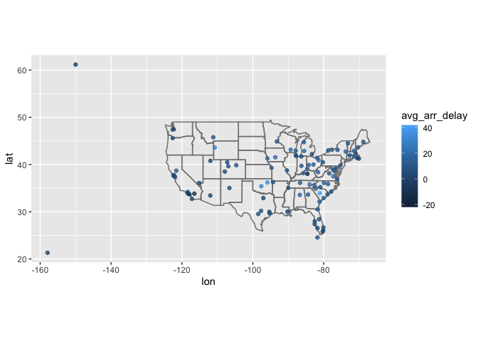<!-- -->

Add the location of the origin and destination (i.e. the lat and lon) to
flights.

``` r
flights %>%
    left_join(
        select(airports, faa, origin_lon=lon, origin_lat=lat),
        by = c("origin" = "faa")
        ) %>%
    left_join(
        select(airports, faa, dest_lon=lon, dest_lat=lat), 
        by = c("dest" = "faa"))
```

    ## # A tibble: 336,776 x 23
    ##     year month   day dep_time sched_dep_time dep_delay arr_time sched_arr_time
    ##    <int> <int> <int>    <int>          <int>     <dbl>    <int>          <int>
    ##  1  2013     1     1      517            515         2      830            819
    ##  2  2013     1     1      533            529         4      850            830
    ##  3  2013     1     1      542            540         2      923            850
    ##  4  2013     1     1      544            545        -1     1004           1022
    ##  5  2013     1     1      554            600        -6      812            837
    ##  6  2013     1     1      554            558        -4      740            728
    ##  7  2013     1     1      555            600        -5      913            854
    ##  8  2013     1     1      557            600        -3      709            723
    ##  9  2013     1     1      557            600        -3      838            846
    ## 10  2013     1     1      558            600        -2      753            745
    ## # … with 336,766 more rows, and 15 more variables: arr_delay <dbl>,
    ## #   carrier <chr>, flight <int>, tailnum <chr>, origin <chr>, dest <chr>,
    ## #   air_time <dbl>, distance <dbl>, hour <dbl>, minute <dbl>, time_hour <dttm>,
    ## #   origin_lon <dbl>, origin_lat <dbl>, dest_lon <dbl>, dest_lat <dbl>

Is there a relationship between the age of a plane and its delays?

``` r
plane_age_summ <- flights %>%
    filter(!is.na(dep_delay), !is.na(arr_delay)) %>%
    inner_join(
        select(planes, tailnum, first_year = year),
        by = "tailnum") %>%
    filter(!is.na(first_year)) %>%  # need to decide if you want to excluded these
    mutate(age = year-first_year) %>%
    select(tailnum, year:day, arr_delay, dep_delay, age) %>%
    group_by(age) %>%
    summarize(
        avg_dep_delay = mean(dep_delay),
        avg_arr_delay = mean(arr_delay)
    )
    
ggplot(plane_age_summ, aes(age,avg_dep_delay)) +
    geom_point()
```

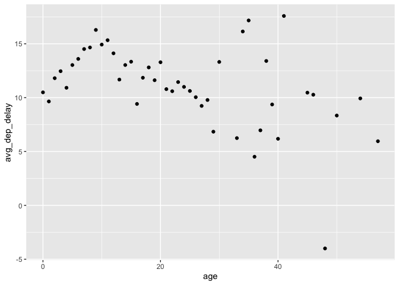<!-- -->

``` r
ggplot(plane_age_summ, aes(age,avg_arr_delay)) +
    geom_point()
```

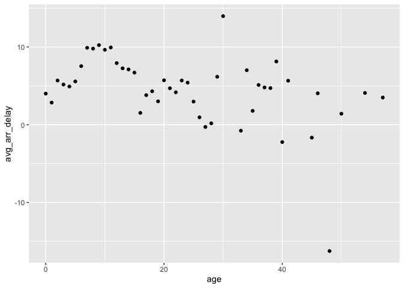<!-- -->

regardless of arrival or departure delay, there is some increasing
positive correlation between age and delay from 0 to 10 years, which
then trails back down

What weather conditions make it more likely to see a delay?

``` r
delay_weather <- select(flights, origin, year, month, day, hour, dep_delay) %>%
    inner_join(weather,
              by = c(
                  "origin" = "origin", 
                  "year" = "year", 
                  "month" = "month", 
                  "day" = "day", 
                  "hour" = "hour"
              ))
```

visib and precip are pretty finite groups (20 and 59 distinct,
respectively)

``` r
delay_weather %>%
    group_by(visib) %>%
    summarise(dep_delay = mean(dep_delay, na.rm = TRUE)) %>%
    ggplot(aes(visib, dep_delay)) +
    geom_point() + 
    geom_smooth()
```

    ## `geom_smooth()` using method = 'loess' and formula 'y ~ x'

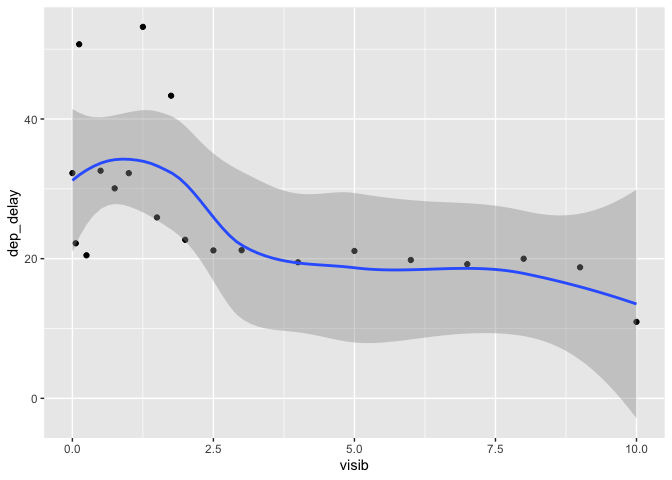<!-- -->

visib shows positive impact when low, flattening out after 2.5 miles,
dropping down at ten miles

``` r
delay_weather %>%
    ungroup() %>%
    group_by(precip) %>%
    summarise(dep_delay = mean(dep_delay, na.rm = TRUE)) %>%
    ggplot(aes(precip, dep_delay)) +
    geom_point() + 
    geom_smooth()
```

    ## `geom_smooth()` using method = 'loess' and formula 'y ~ x'

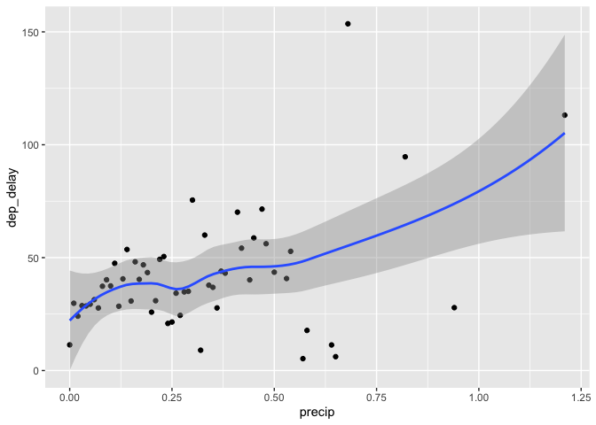<!-- -->

non-zero precip shows increasing positive trend with delay

for other variables, trying categorizing for smaller groups

``` r
delay_weather %>%
    ungroup() %>%
    mutate(temp = round(temp)) %>%
    group_by(temp) %>%
    summarise(dep_delay = mean(dep_delay, na.rm = TRUE)) %>%
    ggplot(aes(temp, dep_delay)) +
    geom_point() + 
    geom_smooth()
```

    ## `geom_smooth()` using method = 'loess' and formula 'y ~ x'

    ## Warning: Removed 1 rows containing non-finite values (stat_smooth).

    ## Warning: Removed 1 rows containing missing values (geom_point).

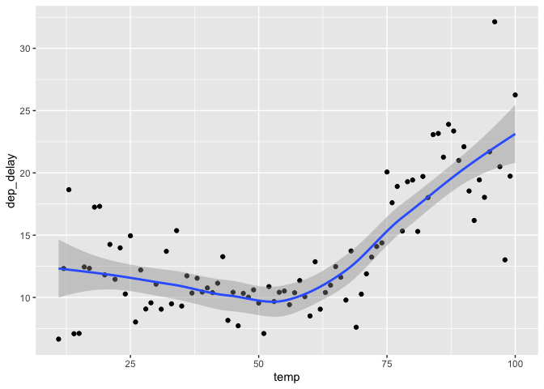<!-- -->

temp shows a poitive trend with delay above \~50 degrees - maybe heavy
volume summer months??

``` r
delay_weather %>%
    ungroup() %>%
    mutate(dewp = cut_width(dewp, 10)) %>%
    group_by(dewp) %>%
    summarise(dep_delay = mean(dep_delay, na.rm = TRUE)) %>%
    ggplot(aes(dewp, dep_delay)) +
    geom_point()
```

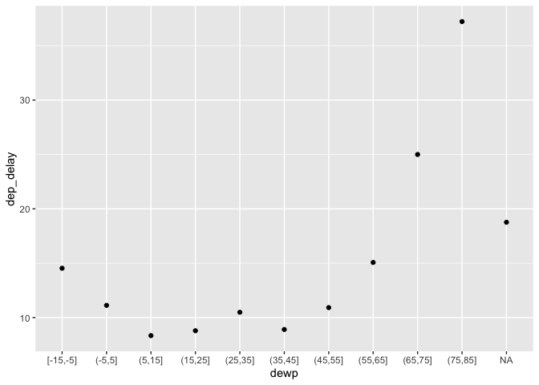<!-- -->

dewp maybe increasing trend around 50 degrees - see temp note - possible
correlation

``` r
delay_weather %>%
    ungroup() %>%
    mutate(humid = cut_width(humid, 10)) %>%
    group_by(humid) %>%
    summarise(dep_delay = mean(dep_delay, na.rm = TRUE)) %>%
    ggplot(aes(humid, dep_delay)) +
    geom_point()
```

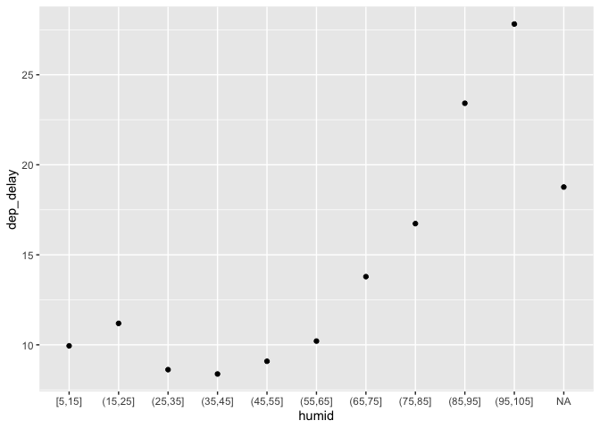<!-- -->

humid maybe increasing trend around 50 - see temp note - possible
correlation

``` r
delay_weather %>%
    ungroup() %>%
    mutate(wind_dir = cut_width(wind_dir, 30, boundary = 0)) %>%
    group_by(wind_dir) %>%
    summarise(dep_delay = mean(dep_delay, na.rm = TRUE)) %>%
    ggplot(aes(wind_dir, dep_delay)) +
    geom_point()
```

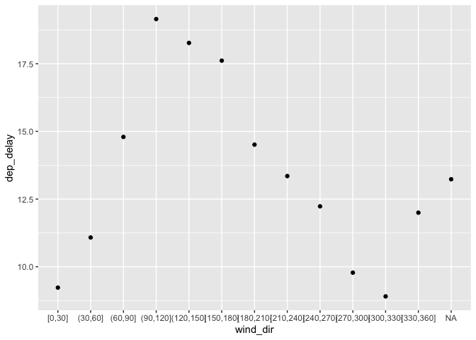<!-- -->

wind\_dir no correlation

``` r
delay_weather %>%
    ungroup() %>%
    mutate(wind_speed = cut_width(wind_speed, 5, boundary = 0)) %>%
    group_by(wind_speed) %>%
    summarise(dep_delay = mean(dep_delay, na.rm = TRUE)) %>%
    ggplot(aes(wind_speed, dep_delay)) +
    geom_point()
```

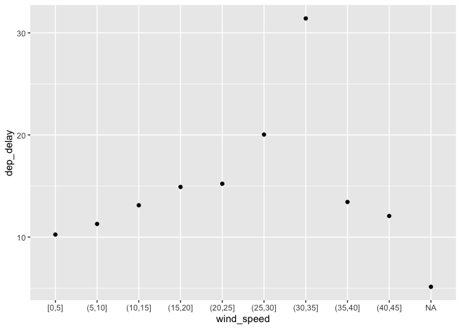<!-- -->

wind\_speed slight positive correlation - needs more investigation

``` r
delay_weather %>%
    ungroup() %>%
    mutate(wind_gust = cut_width(wind_gust, 5, boundary = 0)) %>%
    group_by(wind_gust) %>%
    summarise(dep_delay = mean(dep_delay, na.rm = TRUE)) %>%
    ggplot(aes(wind_gust, dep_delay)) +
    geom_point()
```

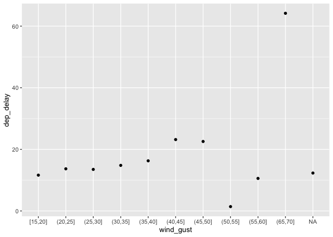<!-- -->

wind\_gust no correlation

``` r
delay_weather %>%
    ungroup() %>%
    mutate(pressure = cut_width(pressure, 5, boundary = 0)) %>%
    group_by(pressure) %>%
    summarise(dep_delay = mean(dep_delay, na.rm = TRUE)) %>%
    ggplot(aes(pressure, dep_delay)) +
    geom_point()
```

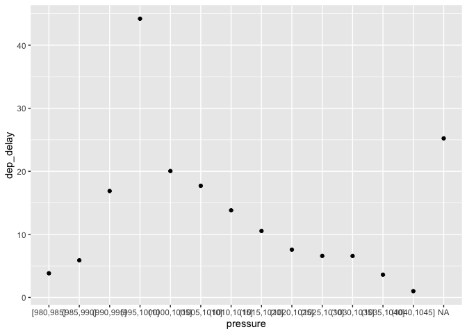<!-- -->

pressure no correlation What happened on June 13 2013? Display the
spatial pattern of delays, and then use Google to cross-reference with
the weather.

``` r
nycweather_20130613 <- flights %>%
    filter(year == 2013, month == 6, day == 13) %>%
    group_by(origin, year, month, day, hour) %>%
    summarise(dep_delay = mean(dep_delay, na.rm = TRUE)) %>%
    inner_join(weather,
               by = c(
                   "origin" = "origin", 
                   "year" = "year", 
                   "month" = "month", 
                   "day" = "day", 
                   "hour" = "hour"
               )) %>%
    group_by(hour) %>%
    summarise(
        dep_delay = mean(dep_delay),
        temp = mean(temp),
        dewp = mean(dewp),
        humid = mean(humid),
        wind_speed = mean(wind_speed),
        precip = mean(precip)
    )
```

    ## `summarise()` has grouped output by 'origin', 'year', 'month', 'day'. You can override using the `.groups` argument.

Storms broadly blew through the eastern / southeastern US - impacting
NYC airports with increasing wind speed and humidity through the day.
Average delays at NYC airports increased accordingly, compounding as
each hour went by.

``` r
nycweather_20130613 %>%
    select(hour, dep_delay, humid, wind_speed)
```

    ## # A tibble: 19 x 4
    ##     hour dep_delay humid wind_speed
    ##    <dbl>     <dbl> <dbl>      <dbl>
    ##  1     5     -1     67.6       5.75
    ##  2     6      2.50  68.9       5.75
    ##  3     7      4.08  70.6       7.67
    ##  4     8      8.29  72.3       7.29
    ##  5     9     22.3   74.2      11.1 
    ##  6    10     28.6   79.8      12.3 
    ##  7    11     32.3   82.3      15.0 
    ##  8    12     62.6   76.2      19.6 
    ##  9    13     53.1   77.0      18.0 
    ## 10    14     60.5   79.6      16.9 
    ## 11    15     59.3   80.4      15.7 
    ## 12    16     51.9   78.5      12.7 
    ## 13    17     63.6   82.5      15.0 
    ## 14    18     69.0   83.9      13.4 
    ## 15    19     95.0   92.7      16.9 
    ## 16    20     85.9   93.2      18.8 
    ## 17    21     83.2   94.5      25.3 
    ## 18    22    123.    88.7      26.5 
    ## 19    23     25.3   93.1      23.0

13.5 filtering joins

exercises 13.5

What does it mean for a flight to have a missing tailnum? What do the
tail numbers that don’t have a matching record in planes have in common?
(Hint: one variable explains \~90% of the problems.)

``` r
flights %>% filter(is.na(tailnum), !is.na(dep_time))
```

    ## # A tibble: 0 x 19
    ## # … with 19 variables: year <int>, month <int>, day <int>, dep_time <int>,
    ## #   sched_dep_time <int>, dep_delay <dbl>, arr_time <int>,
    ## #   sched_arr_time <int>, arr_delay <dbl>, carrier <chr>, flight <int>,
    ## #   tailnum <chr>, origin <chr>, dest <chr>, air_time <dbl>, distance <dbl>,
    ## #   hour <dbl>, minute <dbl>, time_hour <dttm>

every flight with a missing tailnum has no departure time - likely the
planes never showed up at the origination airport from a previous leg
delay

``` r
flights %>% 
    anti_join(planes, by = "tailnum") %>%
    group_by(carrier) %>%
    count() %>%
    arrange(desc(n)) %>%
    inner_join(airlines)
```

    ## Joining, by = "carrier"

    ## # A tibble: 10 x 3
    ## # Groups:   carrier [10]
    ##    carrier     n name                       
    ##    <chr>   <int> <chr>                      
    ##  1 MQ      25397 Envoy Air                  
    ##  2 AA      22558 American Airlines Inc.     
    ##  3 UA       1693 United Air Lines Inc.      
    ##  4 9E       1044 Endeavor Air Inc.          
    ##  5 B6        830 JetBlue Airways            
    ##  6 US        699 US Airways Inc.            
    ##  7 FL        187 AirTran Airways Corporation
    ##  8 DL        110 Delta Air Lines Inc.       
    ##  9 F9         50 Frontier Airlines Inc.     
    ## 10 WN         38 Southwest Airlines Co.

most of the flights with missing tailnum are Envoy or American flights -
documentation says these two airline’s planes cannot be matched via
tailnum

Filter flights to only show flights with planes that have flown at least
100 flights.

``` r
flights %>%
    semi_join(
        flights %>% group_by(tailnum) %>% count() %>% filter(n >= 100),
        by = "tailnum"
    )
```

    ## # A tibble: 230,902 x 19
    ##     year month   day dep_time sched_dep_time dep_delay arr_time sched_arr_time
    ##    <int> <int> <int>    <int>          <int>     <dbl>    <int>          <int>
    ##  1  2013     1     1      517            515         2      830            819
    ##  2  2013     1     1      533            529         4      850            830
    ##  3  2013     1     1      544            545        -1     1004           1022
    ##  4  2013     1     1      554            558        -4      740            728
    ##  5  2013     1     1      555            600        -5      913            854
    ##  6  2013     1     1      557            600        -3      709            723
    ##  7  2013     1     1      557            600        -3      838            846
    ##  8  2013     1     1      558            600        -2      849            851
    ##  9  2013     1     1      558            600        -2      853            856
    ## 10  2013     1     1      558            600        -2      923            937
    ## # … with 230,892 more rows, and 11 more variables: arr_delay <dbl>,
    ## #   carrier <chr>, flight <int>, tailnum <chr>, origin <chr>, dest <chr>,
    ## #   air_time <dbl>, distance <dbl>, hour <dbl>, minute <dbl>, time_hour <dttm>

Combine fueleconomy::vehicles and fueleconomy::common to find only the
records for the most common models.

``` r
fueleconomy::vehicles %>% semi_join(fueleconomy::common)
```

    ## Joining, by = c("make", "model")

    ## # A tibble: 14,531 x 12
    ##       id make  model   year class   trans  drive     cyl displ fuel    hwy   cty
    ##    <dbl> <chr> <chr>  <dbl> <chr>   <chr>  <chr>   <dbl> <dbl> <chr> <dbl> <dbl>
    ##  1  1833 Acura Integ…  1986 Subcom… Autom… Front-…     4   1.6 Regu…    28    22
    ##  2  1834 Acura Integ…  1986 Subcom… Manua… Front-…     4   1.6 Regu…    28    23
    ##  3  3037 Acura Integ…  1987 Subcom… Autom… Front-…     4   1.6 Regu…    28    22
    ##  4  3038 Acura Integ…  1987 Subcom… Manua… Front-…     4   1.6 Regu…    28    23
    ##  5  4183 Acura Integ…  1988 Subcom… Autom… Front-…     4   1.6 Regu…    27    22
    ##  6  4184 Acura Integ…  1988 Subcom… Manua… Front-…     4   1.6 Regu…    28    23
    ##  7  5303 Acura Integ…  1989 Subcom… Autom… Front-…     4   1.6 Regu…    27    22
    ##  8  5304 Acura Integ…  1989 Subcom… Manua… Front-…     4   1.6 Regu…    28    23
    ##  9  6442 Acura Integ…  1990 Subcom… Autom… Front-…     4   1.8 Regu…    24    20
    ## 10  6443 Acura Integ…  1990 Subcom… Manua… Front-…     4   1.8 Regu…    26    21
    ## # … with 14,521 more rows

Find the 48 hours (over the course of the whole year) that have the
worst delays. Cross-reference it with the weather data. Can you see any
patterns?

``` r
highest_delays <- flights %>%
    group_by(year, month, day, hour) %>%
    summarise(dep_delay = mean(dep_delay, rm.na = TRUE)) %>%
    arrange(desc(dep_delay)) %>%
    head(48) %>%
    inner_join(weather)
```

    ## `summarise()` has grouped output by 'year', 'month', 'day'. You can override using the `.groups` argument.

    ## Joining, by = c("year", "month", "day", "hour")

``` r
quantile(select(weather,wind_speed), na.rm = TRUE)
```

    ##         0%        25%        50%        75%       100% 
    ##    0.00000    6.90468   10.35702   13.80936 1048.36058

``` r
quantile(select(highest_delays,wind_speed), na.rm = TRUE)
```

    ## Adding missing grouping variables: `year`, `month`, `day`

    ##        0%       25%       50%       75%      100% 
    ##    0.0000    7.0000   12.0000  526.5533 2013.0000

``` r
highest_delays %>% group_by(month) %>% count()
```

    ## # A tibble: 12 x 2
    ## # Groups:   month [12]
    ##    month     n
    ##    <int> <int>
    ##  1     1     6
    ##  2     2    12
    ##  3     3     9
    ##  4     4     9
    ##  5     5     9
    ##  6     6    30
    ##  7     7    36
    ##  8     8    15
    ##  9     9     3
    ## 10    10     3
    ## 11    11     3
    ## 12    12     6

winds are above average versus the overall average with the high end
range much higher

and most of the delays by hour are in the summer: Jun, Jul and Aug

What does anti\_join(flights, airports, by = c(“dest” = “faa”)) tell
you? What does anti\_join(airports, flights, by = c(“faa” = “dest”))
tell you?

``` r
anti_join(flights, airports, by = c("dest" = "faa")) %>%
    group_by(dest) %>%
    count()
```

    ## # A tibble: 4 x 2
    ## # Groups:   dest [4]
    ##   dest      n
    ##   <chr> <int>
    ## 1 BQN     896
    ## 2 PSE     365
    ## 3 SJU    5819
    ## 4 STT     522

these destinations are outside of the 50 US States and not included in
airports database

``` r
anti_join(airports, flights, by = c("faa" = "dest"))
```

    ## # A tibble: 1,357 x 8
    ##    faa   name                       lat    lon   alt    tz dst   tzone          
    ##    <chr> <chr>                    <dbl>  <dbl> <dbl> <dbl> <chr> <chr>          
    ##  1 04G   Lansdowne Airport         41.1  -80.6  1044    -5 A     America/New_Yo…
    ##  2 06A   Moton Field Municipal A…  32.5  -85.7   264    -6 A     America/Chicago
    ##  3 06C   Schaumburg Regional       42.0  -88.1   801    -6 A     America/Chicago
    ##  4 06N   Randall Airport           41.4  -74.4   523    -5 A     America/New_Yo…
    ##  5 09J   Jekyll Island Airport     31.1  -81.4    11    -5 A     America/New_Yo…
    ##  6 0A9   Elizabethton Municipal …  36.4  -82.2  1593    -5 A     America/New_Yo…
    ##  7 0G6   Williams County Airport   41.5  -84.5   730    -5 A     America/New_Yo…
    ##  8 0G7   Finger Lakes Regional A…  42.9  -76.8   492    -5 A     America/New_Yo…
    ##  9 0P2   Shoestring Aviation Air…  39.8  -76.6  1000    -5 U     America/New_Yo…
    ## 10 0S9   Jefferson County Intl     48.1 -123.    108    -8 A     America/Los_An…
    ## # … with 1,347 more rows

in 2013, no flights from NYC airports had these airports as a
desitnation

You might expect that there’s an implicit relationship between plane and
airline, because each plane is flown by a single airline. Confirm or
reject this hypothesis using the tools you’ve learned above.

``` r
flights %>%
    filter(!is.na(tailnum)) %>%
    distinct(tailnum, carrier) %>%
    group_by(tailnum) %>%
    filter(n() > 1) %>%
    left_join(airlines, by = "carrier") %>%
    arrange(tailnum, carrier) 
```

    ## # A tibble: 34 x 3
    ## # Groups:   tailnum [17]
    ##    carrier tailnum name                    
    ##    <chr>   <chr>   <chr>                   
    ##  1 9E      N146PQ  Endeavor Air Inc.       
    ##  2 EV      N146PQ  ExpressJet Airlines Inc.
    ##  3 9E      N153PQ  Endeavor Air Inc.       
    ##  4 EV      N153PQ  ExpressJet Airlines Inc.
    ##  5 9E      N176PQ  Endeavor Air Inc.       
    ##  6 EV      N176PQ  ExpressJet Airlines Inc.
    ##  7 9E      N181PQ  Endeavor Air Inc.       
    ##  8 EV      N181PQ  ExpressJet Airlines Inc.
    ##  9 9E      N197PQ  Endeavor Air Inc.       
    ## 10 EV      N197PQ  ExpressJet Airlines Inc.
    ## # … with 24 more rows

confirms that several planes (in the flights dataset) were
owned/operated by two distinct carriers in 2013
